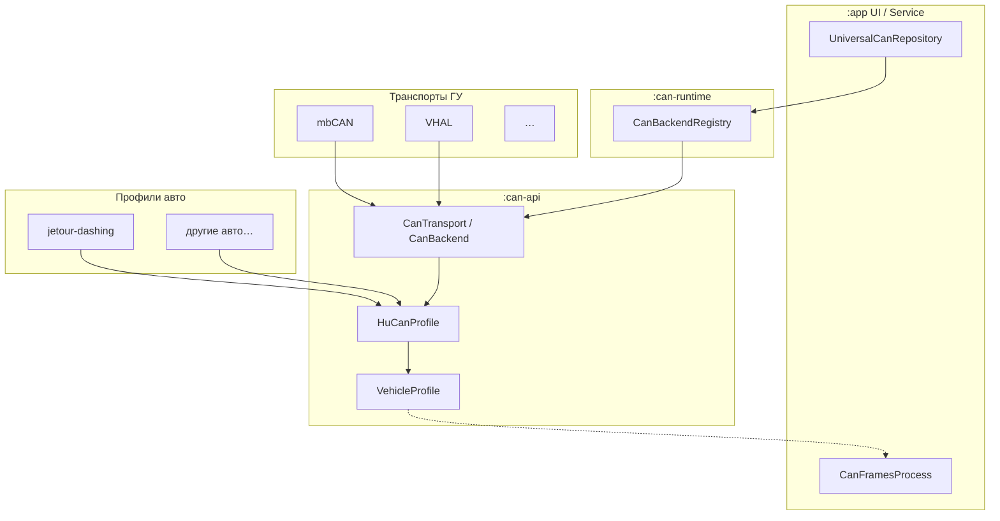
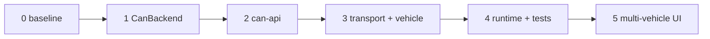

# План рефакторинга CAN backend

Документ фиксирует поэтапный переход от текущей схемы (`UniversalCanRepository` + два `object`-репозитория с дублированием `if/else`) к интерфейсу `CanBackend`, реестру backend'ов и (опционально) Gradle-модулям.

**Связанные документы:** [CAN_BACKENDS_RU.md](CAN_BACKENDS_RU.md)

**Принципы:**

- **Runtime-выбор**, не product flavor. Flavor `ru`/`en` — только язык UI.
- **Два независимых измерения:** *профиль автомобиля* (марка/модель/прошивка) и *транспорт ГУ* (mbCAN, VHAL, …). Сегодня в коде они слиты в `HeadUnitCanMode` — это временно.
- **Один APK** может содержать несколько профилей авто; активный профиль и transport выбираются в runtime (настройки / auto-detect).

---

## Два канала CAN-данных (не путать)

| Канал | Код | Зависит от авто? | Сейчас |
|-------|-----|------------------|--------|
| **TBox UDP** | `CanFramesProcess`, `CanDataRepository` | Да (CAN ID, `carType`, калибровка топлива) | Jetour Dashing |
| **Головное устройство** | `UniversalCanRepository`, `MbCanRepository`, `Android10VhalRepository` | Да (propertyId, JSON прошивки, decode) | Jetour Dashing (Adayo HU) |

План ниже — про **CAN backend ГУ**. Рефакторинг TBox-декодера (`CanFramesProcess`) — отдельная линия работ; на этапах 2+ в `:can-api` закладывается общий `VehicleProfile`, чтобы позже связать оба канала под одним «профилем авто».

---

## Целевая архитектура (мульти-авто)



**Термины:**

| Термин | Смысл | Пример |
|--------|--------|--------|
| `VehicleProfile` | Марка/модель/семейство HU + правила TBox CAN | `jetour_dashing` |
| `HuCanProfile` | Каталог сигналов, command registry, маппинг propertyId **для этого авто** | `FirmwareVehicleJsonMapper`, `MbCanKnown*PropertyId` |
| `HuCanTransport` | *Как* подключиться к стеку CAN на HU (API bind/read/write) | mbCAN, VHAL |
| `CanBackendId` | Стабильный ключ «профиль + transport» | `jetour_dashing.android9_mbcan` |
| `CanBackend` | Runtime-связка `HuCanTransport` + `HuCanProfile` (единый контракт для UI) | `MbCanBackend`, `VhalBackend` |

**Сегодня:** одна машина (Dashing), два transport → `HeadUnitCanMode` фактически = `CanBackendId` без префикса авто.

**Завтра:** `Settings` хранит `vehicleProfileId` + `preferredTransportId`; registry отдаёт fallback-цепочку **внутри профиля** (как сейчас 3+3 для mbCAN↔VHAL на Dashing).

**Product flavor под авто не делаем** — тот же аргument, что и для transport: пользователь/авто определяются в runtime, APK остаётся универсальным сборником профилей.

---

## Обзор этапов

| Этап | Где | Цель | Риск |
|------|-----|------|------|
| **0** | `:app` | Baseline (Dashing, mbCAN + VHAL) | — |
| **1** | `:app` | `CanBackend` + registry + fallback на N transport **в рамках одного профиля** | Низкий |
| **2** | `:can-api` | Контракты; задел `VehicleProfile` / `CanBackendId` / нейтральные имена типов | Низкий |
| **3** | transport + vehicle modules | `:can-transport-*`, `:vehicle-jetour-dashing` | Средний |
| **4** | `:can-runtime` + тесты | Router, auto-bind, multi-profile registry, unit-тесты | Низкий–средний |
| **5** *(опционально)* | `:app` + `:vehicle-*` | UI выбора авто, второй `VehicleProfile`, TBox decoder plugin | Средний |



Этап **5** — только когда реально появляется второе авто; до этого достаточно этапов 1–4 с одним захардкоженным `VehicleProfile.JETOUR_DASHING`.

---

## Этап 0 — текущее состояние

**Статус:** выполнен (baseline).

- Jetour Dashing — единственный неявный `VehicleProfile`.
- `MbCanRepository` + `Android10VhalRepository` — transport-реализации с **зашитым** Dashing-маппингом (`MbCanKnown*PropertyId`, `FirmwareVehicleJsonMapper` → `/system/etc/adayo/vehicle/*.json`).
- `UniversalCanRepository` — ~22 копии `flatMapLatest { if (Android9) … else … }`.
- `HeadUnitCanMode.otherMode()` — fallback только между двумя transport на одном HU.
- `CanFramesProcess.carType` — отдельная Dashing-специфика (TBox).
- Product flavors: `ru` / `en`.

**Когда переходить к этапу 1:** дублирование в `UniversalCanRepository` мешает сопровождать код или планируется 3-й transport на Dashing.

---

## Этап 1 — интерфейс `CanBackend` в `:app`

**Статус:** запланирован. Детальный план — [ниже](#этап-1--детальный-план).

**Цель:** контракт transport-backend'а, registry с ordered fallback, убрать дублирование в фасаде. **Заложить расширяемость** под другие авто без реализации второго профиля.

**Критерии готовности:**

- [ ] `CanBackendId` — тип-ключ backend'а (на этапе 1 значения 1:1 с `HeadUnitCanMode.storageValue` или thin wrapper).
- [ ] `CanBackend` — lifecycle, подписки, команды, все `StateFlow` фасада.
- [ ] `CanBackendRegistry` — `Map<CanBackendId, CanBackend>` + **ordered** `fallbackOrder(profile)` (сейчас один профиль `JETOUR_DASHING`, порядок = сохранённый mode → остальные).
- [ ] `MbCanBackend` / `VhalBackend` — делегаты в существующие `object`, Dashing-логика не трогается.
- [ ] `UniversalCanRepository` — `selectBackendStateFlow` / `activeBackend()`, без прямых ссылок на `MbCanRepository` / `Android10VhalRepository`.
- [ ] `autoResolveModeOnStartup` — цикл по `registry.fallbackOrder(...)`, не `otherMode()`.
- [ ] `./gradlew testRuDebugUnitTest` зелёный; поведение 3+3 на Dashing 1:1.

**Не входит в этап 1:**

- Gradle-модули, UI выбора авто, рефакторинг `CanFramesProcess`.
- Вынос `FirmwareVehicleJsonMapper` в отдельный vehicle-модуль.
- Переименование всех `MbCan*` → `Can*` (только комментарии / `CanBackendId` как задел).

---

## Этап 2 — модуль `:can-api`

**Статус:** будущий.

**Цель:** общие контракты без привязки к Jetour; единая точка для transport-модулей и vehicle-модулей.

**Содержимое `:can-api`:**

| Группа | Типы |
|--------|------|
| Идентификация | `VehicleProfileId`, `HuCanTransportId`, `CanBackendId` |
| Профиль авто | `VehicleProfile` (id, displayName, supportedBackendIds, fallbackOrder) |
| HU CAN домен | `CanSignal`, `CanCommand`, `CanCommandResult`, `CanBinaryState`, `CanSeatModeState`, `CanAvailability` (+ typealias на legacy `MbCan*` на переходный период) |
| Transport | `CanBackend` (или split: `HuCanTransport` + adapter) |
| Каталог | `HuCanProfile` — интерфейс: command registry, decode hooks, widget→signal map |
| Инфра | `CanBackendLogger`, `WidgetSignalRegistry` |

**`HuCanProfile` (интерфейс, реализация позже в `:vehicle-jetour-dashing`):**

- resolveWritePropertyId / resolveReadPropertyId (сейчас `FirmwareVehicleJsonMapper` + explicit maps).
- decode binary/seat states (сейчас `MbCanSignalStateEngine` — часть Dashing-специфична, часть общая).
- список поддерживаемых `CanSignal` / `MbCanCommandSpec`.

**Зависимости:** Kotlin, coroutines, min Android SDK. **Без** Jetour JSON, **без** `com.mengbo`, **без** `android.car`.

**`:app`:** `implementation(project(":can-api"))`; реализации пока остаются в `:app`.

**Критерии готовности:**

- [ ] `settings.gradle.kts`: `include(":can-api")`.
- [ ] `VehicleProfile.JETOUR_DASHING` — единственный профиль, константа в `:can-api` или `:vehicle-jetour-dashing` stub.
- [ ] Сборка и unit-тесты без регрессий.

---

## Этап 3 — модули transport + vehicle

**Статус:** будущий.

**Цель:** изолировать **transport** (как ходим в API) и **vehicle** (какие ID и decode для конкретного авто). Новое авто = новый `:vehicle-*` модуль, без копирования mbCAN/VHAL.

**Структура:**

```
:can-api
:can-transport-mbcan      ← MbCanEngineFacade, generic bind/poll/push
:can-transport-vhal       ← CarPropertyBridge, generic VHAL connect
:vehicle-jetour-dashing   ← HuCanProfile, FirmwareVehicleJsonMapper, Dashing command maps
                          ← MbCanBackend / VhalBackend = transport + JetourDashingProfile
:app                      ← UI, Settings, Tbox, CanFramesProcess (пока)
```

**Граф зависимостей:**

- `:can-transport-mbcan` → `:can-api`
- `:can-transport-vhal` → `:can-api`
- `:vehicle-jetour-dashing` → `:can-api`, `:can-transport-mbcan`, `:can-transport-vhal`
- transport-модули **не зависят** друг от друга и **не знают** про Jetour
- `:vehicle-*` **не зависят** друг от друга
- `:app` → `:vehicle-jetour-dashing`, (позже `:can-runtime`)

**Добавление нового авто (после этапа 3):**

1. `:vehicle-other-brand-model` — свой `HuCanProfile`, свои JSON/enum маппинги.
2. Реализации `CanBackend` для комбинаций «этот профиль + поддерживаемые transport».
3. Регистрация в `CanBackendRegistry` — **без** правок mbCAN/VHAL transport-модулей.
4. TBox: `:vehicle-*` или `TboxCanDecoder` в профиле — связка с `CanFramesProcess` (этап 5).

**Критерии готовности:**

- [ ] Нет `import vad.dashing.tbox.*` в transport/vehicle модулях (кроме `:can-api`).
- [ ] Dashing: ручная проверка mbCAN + VHAL на ГУ.
- [ ] `./gradlew testRuDebugUnitTest` зелёный.

---

## Этап 4 — `:can-runtime` и тесты

**Статус:** будущий.

**Цель:** фасад и auto-bind в отдельном модуле; registry **по профилю авто**; unit-тесты без device.

**Содержимое `:can-runtime`:**

- `UniversalCanRepository` / `CanBackendRouter`
- `CanBackendRegistry`:
  - `backends: Map<CanBackendId, CanBackend>`
  - `profiles: Map<VehicleProfileId, VehicleProfile>`
  - `fallbackOrder(profileId, preferredTransportId): List<CanBackendId>`
- `activeVehicleProfile: StateFlow<VehicleProfileId>` (этап 4: константа `JETOUR_DASHING`; этап 5: из Settings)
- `modeSwitchMutex`, `autoResolveOnStartup`, `bindModeWithRetries`

**Тесты:**

- `FakeCanBackend` + `FakeVehicleProfile`
- Fallback: primary fail → alternative success **внутри одного профиля**
- Смена `CanBackendId` → `flatMapLatest` переключает flow
- При нескольких профилях в registry: смена `VehicleProfileId` rebind'ит другой набор backend'ов (задел под этап 5)

**Зависимости:** `:can-runtime` → `:can-api` + все `:vehicle-*`, подключённые в app.

---

## Этап 5 *(опционально)* — multi-vehicle в продукте

**Статус:** будущий; **не начинать**, пока нет второго реального авто и HU.

**Цель:** пользователь (или auto-detect) выбирает автомобиль; TBox и HU CAN используют один `VehicleProfileId`.

**Работы:**

- Settings: `vehicleProfileId` в DataStore; UI списка профилей (или скрытый debug).
- `CanFramesProcess` → `TboxCanDecoder` из активного `VehicleProfile`.
- Auto-detect профиля (эвристики: VIN через TBox, путь JSON на HU, model prop) — по необходимости.
- Документация: как добавить `:vehicle-new-car` (checklist для контributor).

**Не делать заранее:** пустые модули под «будущие» марки, flavor'ы под авто, дублирование transport-кода в vehicle-модулях.

---

# Этап 1 — детальный план

## 1.1. Новые файлы

| Файл | Назначение |
|------|------------|
| `CanBackendId.kt` | `@JvmInline value class` или `enum` с ключами `android9_mbcan`, `android10_vhal`; позже — `jetour_dashing.android9_mbcan` |
| `CanBackend.kt` | Интерфейс backend'а |
| `CanBackendRegistry.kt` | Map id→backend, `fallbackOrder(...)` для одного профиля Dashing |
| `MbCanBackend.kt` | Делегат в `MbCanRepository` |
| `VhalBackend.kt` | Делегат в `Android10VhalRepository` |

## 1.2. `CanBackendId` (задел под multi-vehicle)

На этапе 1 — минимальная форма, совместимая с `HeadUnitCanMode.storageValue`:

```kotlin
enum class CanBackendId(val storageValue: String) {
    Android9MbCan("android9_mbcan"),
    Android10Vhal("android10_vhal");

    /** Позже: composite id, напр. "jetour_dashing.android9_mbcan". */
    companion object {
        fun fromHeadUnitCanMode(mode: HeadUnitCanMode): CanBackendId = …
        fun fromStorageValue(raw: String?): CanBackendId = …
    }
}
```

`HeadUnitCanMode` **не удаляем** — Settings/UI продолжают использовать его; маппинг `HeadUnitCanMode` ↔ `CanBackendId` 1:1 до этапа 5.

Константа профиля (пока без Settings):

```kotlin
object VehicleProfileIds {
    const val JETOUR_DASHING = "jetour_dashing"
}
```

## 1.3. `CanBackendRegistry`

```kotlin
object CanBackendRegistry {
    private val backends: Map<CanBackendId, CanBackend> = mapOf(
        CanBackendId.Android9MbCan to MbCanBackend,
        CanBackendId.Android10Vhal to VhalBackend,
    )

    fun get(id: CanBackendId): CanBackend = backends.getValue(id)

    /** Ordered fallback для auto-bind на Jetour Dashing. */
    fun fallbackOrder(
        vehicleProfileId: String = VehicleProfileIds.JETOUR_DASHING,
        preferred: CanBackendId,
    ): List<CanBackendId> {
        require(vehicleProfileId == VehicleProfileIds.JETOUR_DASHING) {
            "Unknown vehicle profile: $vehicleProfileId"
        }
        return listOf(preferred) + backends.keys.filter { it != preferred }
    }

    fun allBackends(): Collection<CanBackend> = backends.values
}
```

При втором авто registry расширяется: `when (vehicleProfileId) { JETOUR_DASHING -> … OTHER -> … }`.

## 1.4. Контракт `CanBackend`

Без изменений по поверхности — lifecycle, подписки, команды, 22× `StateFlow` (см. предыдущую версию плана).

**Добавить метаданные:**

```kotlin
interface CanBackend {
    val id: CanBackendId
    /** Transport layer; совпадает с id на этапе 1. */
    val transportId: CanBackendId get() = id
    // … остальное
}
```

## 1.5. Рефакторинг `UniversalCanRepository`

- `_mode` / Settings по-прежнему `HeadUnitCanMode`; внутри: `activeBackendId = CanBackendId.fromHeadUnitCanMode(_mode.value)`.
- `selectBackendStateFlow` / `activeBackend()` через `CanBackendRegistry.get(...)`.
- `unbindLocked`: `CanBackendRegistry.allBackends().forEach { it.unbind() }`.
- `autoResolveModeOnStartup`:

```kotlin
val preferredId = CanBackendId.fromHeadUnitCanMode(primaryMode)
for (candidateId in CanBackendRegistry.fallbackOrder(preferred = preferredId)) {
    bindModeWithRetries(candidateId, …)
}
```

## 1.6. Чеклист PR (этап 1)

### Подготовка

- [ ] [CAN_BACKENDS_RU.md](CAN_BACKENDS_RU.md) §1–2.
- [ ] Baseline: `./gradlew testRuDebugUnitTest`.

### Реализация

1. [ ] `CanBackendId.kt`, `VehicleProfileIds` (object с одной константой).
2. [ ] `CanBackend.kt`, `MbCanBackend.kt`, `VhalBackend.kt`.
3. [ ] `CanBackendRegistry.kt`.
4. [ ] Рефакторинг `UniversalCanRepository.kt` (registry, generic flows, fallback loop).
5. [ ] UI / Settings **не менять**; публичный API `UniversalCanRepository` сохранить.

### Проверка

- [ ] `./gradlew testRuDebugUnitTest` + `assembleRuDebug`
- [ ] Grep: нет `otherMode()`, нет прямого `MbCanRepository` / `Android10VhalRepository` в фасаде
- [ ] Комментарий в `CanBackendRegistry`: как добавить transport / профиль

### Review-фокус

- Mutex и 3+3 auto-bind на Dashing без изменений.
- `fallbackOrder` детерминирован и расширяем под N transport.
- `CanBackendId` не привязан жёстко к enum из двух значений в **логике** registry (map, не `when` по двум веткам в фасаде).

## 1.7. Оценка diff

| Метрика | Ожидание |
|---------|----------|
| Новые файлы | 5 |
| `UniversalCanRepository.kt` | −200…−250 строк net |
| UI / Settings | 0 |
| `MbCanRepository` / `Android10VhalRepository` | 0 |
| Unit-тесты | 0 (этап 4) |

## 1.8. Откат

Revert PR — адаптеры не меняют transport-логику; безопасно.

---

## Checklist: добавление нового автомобиля (после этапа 3–4)

1. [ ] Создать `:vehicle-<slug>` с `HuCanProfile` (property maps, decode, commands).
2. [ ] Определить поддерживаемые `HuCanTransportId` (mbCAN? VHAL? свой?).
3. [ ] Реализовать `CanBackend` для каждой пары profile+transport.
4. [ ] Зарегистрировать в `CanBackendRegistry.profiles` + `backends`.
5. [ ] Добавить `TboxCanDecoder` / правила в `CanFramesProcess` для TBox CAN ID.
6. [ ] Unit-тесты профиля (decode, command resolve) в `:vehicle-*`.
7. [ ] Ручная проверка на HU целевого авто.
8. [ ] *(Этап 5)* UI / Settings для выбора профиля.

---

## История документа

| Дата | Изменение |
|------|-----------|
| 2026-06-20 | Первая версия: этапы 0–4, детальный план этапа 1 |
| 2026-06-20 | Multi-vehicle: transport × profile, этап 5, `CanBackendId`, `:vehicle-*` модули, checklist |
