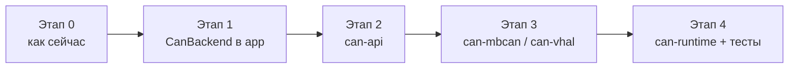

# План рефакторинга CAN backend

Документ фиксирует поэтапный переход от текущей схемы (`UniversalCanRepository` + два `object`-репозитория с дублированием `if/else`) к интерфейсу `CanBackend`, реестру backend'ов и (опционально) Gradle-модулям.

**Связанные документы:** [CAN_BACKENDS_RU.md](CAN_BACKENDS_RU.md)

**Принцип:** runtime-выбор backend (не product flavor). Flavor `ru`/`en` не затрагиваются.

---

## Обзор этапов

| Этап | Где | Цель | Риск |
|------|-----|------|------|
| **0** | `:app` | Текущее состояние, без изменений | — |
| **1** | `:app` | Интерфейс `CanBackend` + убрать дублирование в `UniversalCanRepository` | Низкий |
| **2** | `:can-api` + `:app` | Вынести контракты и доменные типы в отдельный модуль | Низкий |
| **3** | `:can-mbcan`, `:can-vhal` | Разнести реализации backend'ов по модулям | Средний |
| **4** | `:can-runtime` + тесты | Фасад, auto-bind, unit-тесты с `FakeCanBackend` | Низкий |



---

## Этап 0 — текущее состояние

**Статус:** выполнен (baseline).

- `MbCanRepository` и `Android10VhalRepository` — два симметричных `object` в `app/src/main/java/vad/dashing/tbox/mbcan/`.
- `UniversalCanRepository` делегирует через ~22 копии `mode.flatMapLatest { if (Android9) ... else ... }` и `if (_mode.value == ...)`.
- `HeadUnitCanMode.otherMode()` жёстко переключает между двумя значениями.
- Reflection к vendor API (`MbCanEngineFacade`, `CarPropertyBridge`) — compile-time зависимостей нет.
- Product flavors: только `ru` / `en`.

**Когда переходить к этапу 1:** при добавлении 3-го backend или когда дублирование в `UniversalCanRepository` мешает сопровождать код.

---

## Этап 1 — интерфейс `CanBackend` в `:app`

**Статус:** запланирован. Детальный план — [ниже](#этап-1--детальный-план).

**Цель:** один контракт для backend'ов, generic-делегирование в фасаде, fallback-список вместо `otherMode()`, без изменения публичного API для UI/сервисов.

**Критерии готовности:**

- [ ] `CanBackend` описывает lifecycle, подписки, команды и все `StateFlow`, которые сейчас проксирует `UniversalCanRepository`.
- [ ] `MbCanBackend` и `VhalBackend` делегируют в существующие `MbCanRepository` / `Android10VhalRepository` (логика backend'ов не переписывается).
- [ ] `UniversalCanRepository` использует `selectBackendStateFlow` / `activeBackend()` вместо повторяющихся `if/else`.
- [ ] `autoResolveModeOnStartup` перебирает список кандидатов, а не `primary.otherMode()`.
- [ ] `./gradlew testRuDebugUnitTest` — все тесты зелёные.
- [ ] Поведение bind/unbind/auto-bind 1:1 с этапом 0 (ручная проверка на ГУ при возможности).

**Не входит в этап 1:**

- Gradle-модули (`:can-api` и далее).
- Переименование `MbCan*` типов в нейтральные `Can*`.
- Рефакторинг внутренностей `MbCanRepository` / `Android10VhalRepository`.

---

## Этап 2 — модуль `:can-api`

**Статус:** будущий.

**Цель:** вынести контракты и доменные типы из `:app` в Android Library без UI и без конкретных реализаций.

**Содержимое `:can-api`:**

- `CanBackend`, опционально `CanBackendStates` (группировка `StateFlow`).
- `HeadUnitCanMode` (или отдельный `CanBackendId`, если нужно развязать от Settings).
- `MbCanSignal`, `MbCanCommand`, `MbCanCommandResult`, `MbCanBinaryState`, `MbCanSeatModeState`, `MbCanAvailability`.
- `MbCanCatalog`, registry команд (`MbCanCommandRegistry`), `MbCanSignalStateEngine` — если остаются общими для всех backend'ов.

**Зависимости модуля:** Kotlin, `kotlinx-coroutines`, минимальный Android SDK.

**Изменения в `:app`:**

- `implementation(project(":can-api"))`.
- Репозитории (`MbCanRepository`, `Android10VhalRepository`, `UniversalCanRepository`) **пока остаются в `:app`**, импортируют типы из `:can-api`.

**Критерии готовности:**

- [ ] `settings.gradle.kts`: `include(":can-api")`.
- [ ] Сборка `assembleRuDebug` / `assembleEnDebug` без регрессий.
- [ ] Unit-тесты app проходят.

**Блокеры для этапа 3 (решать по ходу этапа 2):**

- Константы виджетов (`DRIVE_MODE_WIDGET_DATA_KEY`, …) — перенести в `:can-api` или в `WidgetSignalRegistry`.
- `TboxRepository.addLog` / `AppContextHolder` — позже заменить на `CanBackendLogger` + `Context` в `bind`.

---

## Этап 3 — модули `:can-mbcan` и `:can-vhal`

**Статус:** будущий.

**Цель:** изолировать реализации backend'ов; `:app` и UI не зависят от деталей mbCAN/VHAL.

**Структура:**

```
:can-api          ← контракты и типы
:can-mbcan        ← MbCanRepository, MbCanEngineFacade, MbCanJobManager, MbCanBackend
:can-vhal         ← Android10VhalRepository, FirmwareVehicleJsonMapper, VhalBackend
:app              ← UI, Settings, BackgroundService, Tbox
```

**Граф зависимостей:**

- `:can-mbcan` → `:can-api`
- `:can-vhal` → `:can-api`
- `:can-mbcan` и `:can-vhal` **не зависят друг от друга**
- `:app` → `:can-mbcan`, `:can-vhal`, (позже `:can-runtime`)

**Работы:**

1. Перенос файлов из `app/.../mbcan/` в соответствующие модули.
2. Инверсия зависимостей от app:
   - `CanBackendLogger` в `:can-api`, реализация в `:app`.
   - `Context` передаётся в `bind`, убрать `AppContextHolder` из CAN-модулей (или обернуть).
3. Реестр `widgetKey → MbCanSignal` — в `:can-api` или `:can-mbcan` + `:can-vhal` (общий registry).

**Критерии готовности:**

- [ ] Нет `import vad.dashing.tbox.*` в `:can-mbcan` / `:can-vhal` (кроме `:can-api`).
- [ ] `./gradlew testRuDebugUnitTest` зелёный.
- [ ] Ручная проверка bind/VHAL/mbCAN на ГУ.

**Когда откладывать:** если этап 1 закрыл боль с дублированием и 3-й backend не на горизонте — этап 3 можно отложить.

---

## Этап 4 — `:can-runtime` и тесты

**Статус:** будущий.

**Цель:** фасад и auto-bind в отдельном модуле; покрытие unit-тестами переключения mode и fallback без Robolectric/device.

**Содержимое `:can-runtime`:**

- `UniversalCanRepository` (или переименование в `CanBackendRouter`).
- `CanBackendRegistry` — `Map<HeadUnitCanMode, CanBackend>` + порядок fallback.
- Логика `modeSwitchMutex`, `autoResolveModeOnStartup`, `bindModeWithRetries`.

**Тесты (новые):**

- `FakeCanBackend` — controllable `availability`, счётчики `bind`/`unbind`.
- Смена mode → `flatMapLatest` отдаёт flow нового backend.
- Auto-bind: primary fail → alternative success; оба fail → lock + revert.
- Rebind при `setMode`: старый `unbind`, новый `bind`.

**Зависимости:**

- `:can-runtime` → `:can-api`, `:can-mbcan`, `:can-vhal`
- `:app` → `:can-runtime`

**Критерии готовности:**

- [ ] Тесты auto-bind/mode switch в `:can-runtime/src/test`.
- [ ] UI по-прежнему обращается только к фасаду (одна точка входа).

---

# Этап 1 — детальный план

## 1.1. Новые файлы

| Файл | Назначение |
|------|------------|
| `app/src/main/java/vad/dashing/tbox/mbcan/CanBackend.kt` | Интерфейс + `HeadUnitCanMode.fallbackCandidates()` |
| `app/src/main/java/vad/dashing/tbox/mbcan/MbCanBackend.kt` | `object MbCanBackend : CanBackend` → делегирует в `MbCanRepository` |
| `app/src/main/java/vad/dashing/tbox/mbcan/VhalBackend.kt` | `object VhalBackend : CanBackend` → делегирует в `Android10VhalRepository` |

Опционально (если интерфейс слишком длинный — можно на этапе 1.5):

- `CanBackendStates` data class с группировкой `StateFlow` (фасад всё равно экспортирует старые имена свойств).

## 1.2. Контракт `CanBackend`

Интерфейс повторяет **публичную** поверхность, которую сегодня проксирует `UniversalCanRepository`:

**Lifecycle**

- `suspend fun bind(scope: CoroutineScope)`
- `suspend fun unbind()`
- `suspend fun warmUpAvailabilityForUi()`

**Подписки / interests**

- `suspend fun setSourceWidgetKeys(sourceId: String, widgetKeys: Set<String>)`
- `suspend fun setSourceSignals(sourceId: String, signals: Set<MbCanSignal>)`
- `fun enqueueClearSource(sourceId: String)`
- `fun widgetConfigsNeedMbCan(dataKeys: Iterable<String>): Boolean`

**Команды**

- `suspend fun execute(command: MbCanCommand): MbCanCommandResult`
- `suspend fun setAudioVolume(value: Int): MbCanCommandResult`
- `fun rememberAudioVolumeLastNonZeroInSession(value: Int)`
- `fun audioVolumeRestoreCandidate(defaultValue: Int = 10): Int`

**StateFlow (22 штуки — как в `UniversalCanRepository` сегодня)**

- `availability`
- `steeringWheelHeatState`, `wiperMaintenanceState`, `parkingRadarState`, `frontWindscreenHeatState`
- `hvacDefrosterState`, `hvacAirRecirculationState`, `hvacAcPowerState`, `hvacAutoState`, `hvacDefrosterFrontState`
- `frontLeftSeatModeState`, `frontRightSeatModeState`, `rearLeftSeatModeState`, `rearRightSeatModeState`
- `audioVolumeState`, `audioVolumeSpeedState`, `audioVolumeSpeedModeState`
- `carSettingsEpsMode`, `carSettingsDriveMode`, `carSettingsDriveMode6dctWet`
- `engineRpmState`, `engineTemperatureState`, `carSpeedState`

**Метаданные**

- `val mode: HeadUnitCanMode` — `Android9MbCan` / `Android10Vhal`.

## 1.3. Реализации-адаптеры

`MbCanBackend` и `VhalBackend` — тонкие делегаты, **без** переноса логики из существующих `object`:

```kotlin
object MbCanBackend : CanBackend {
    override val mode = HeadUnitCanMode.Android9MbCan
    override val availability get() = MbCanRepository.availability
    override suspend fun bind(scope: CoroutineScope) = MbCanRepository.bind(scope)
    // ...
}
```

Существующие `MbCanRepository` и `Android10VhalRepository` **не переименовываем** на этапе 1 — меньше diff, проще review.

## 1.4. Рефакторинг `UniversalCanRepository`

### Реестр

```kotlin
private val backends: Map<HeadUnitCanMode, CanBackend> = mapOf(
    HeadUnitCanMode.Android9MbCan to MbCanBackend,
    HeadUnitCanMode.Android10Vhal to VhalBackend,
)
```

### Generic для StateFlow

```kotlin
@OptIn(ExperimentalCoroutinesApi::class)
private inline fun <T> selectBackendStateFlow(
    crossinline pick: CanBackend.() -> StateFlow<T>,
    initial: T,
): StateFlow<T> = _mode
    .flatMapLatest { backends.getValue(it).pick() }
    .stateIn(scope, SharingStarted.Eagerly, initial)
```

Заменить все 22 блока `mode.flatMapLatest { if ... }` на однострочники:

```kotlin
val steeringWheelHeatState = selectBackendStateFlow(
    { steeringWheelHeatState },
    MbCanBinaryState.Unknown,
)
```

### Активный backend

```kotlin
private fun activeBackend(): CanBackend = backends.getValue(_mode.value)
```

Все `if (_mode.value == Android9MbCan) MbCan... else Android10...` → `activeBackend().execute(...)` и т.д.

### Переключение mode

`setModeLocked`:

```kotlin
private suspend fun setModeLocked(mode: HeadUnitCanMode, rebindIfBound: Boolean) {
    if (_mode.value == mode) return
    val previous = activeBackend()
    _mode.value = mode
    if (!rebindIfBound) return
    val scopeToRebind = boundScope ?: return
    previous.unbind()
    activeBackend().bind(scopeToRebind)
}
```

`bindLocked` / `warmUpAvailabilityForUiLocked` — через `activeBackend()`.

`unbindLocked` — по-прежнему **оба** backend (как сейчас), чтобы не оставлять висящих подписок:

```kotlin
private suspend fun unbindLocked() {
    boundScope = null
    backends.values.forEach { it.unbind() }
}
```

### Fallback вместо `otherMode()`

В `HeadUnitCanMode.kt` (или extension в `CanBackend.kt`):

```kotlin
fun HeadUnitCanMode.fallbackCandidates(excluding: HeadUnitCanMode = this): List<HeadUnitCanMode> =
    HeadUnitCanMode.entries.filter { it != excluding }
```

В `autoResolveModeOnStartup`:

```kotlin
val candidates = listOf(primaryMode) + primaryMode.fallbackCandidates()
for (candidate in candidates) { ... bindModeWithRetries(candidate, ...) ... }
```

Поведение для двух backend'ов остаётся `primary → alternative`; при N backend'ах порядок задаётся явным списком в registry (можно добавить `CanBackendRegistry.fallbackOrder` позже).

## 1.5. Чеклист PR (этап 1)

### Подготовка

- [ ] Прочитать [CAN_BACKENDS_RU.md](CAN_BACKENDS_RU.md) §1–2 (mode switch, mutex).
- [ ] Зафиксировать baseline: `./gradlew testRuDebugUnitTest`.

### Реализация (порядок коммитов)

1. [ ] Добавить `CanBackend.kt` (интерфейс + `fallbackCandidates`).
2. [ ] Добавить `MbCanBackend.kt`, `VhalBackend.kt`.
3. [ ] Рефакторинг `UniversalCanRepository.kt`:
   - registry + `selectBackendStateFlow` + `activeBackend()`;
   - удалить `otherMode()`;
   - обновить `autoResolveModeOnStartup`.
4. [ ] Убедиться, что публичные свойства/методы `UniversalCanRepository` **не переименованы** (UI не трогаем).

### Проверка

- [ ] `./gradlew testRuDebugUnitTest`
- [ ] `./gradlew assembleRuDebug` (compile)
- [ ] Grep: в `UniversalCanRepository` нет прямых `MbCanRepository` / `Android10VhalRepository` кроме registry (только `MbCanBackend` / `VhalBackend`).
- [ ] Grep: нет `otherMode()`.

### Review-фокус

- Mutex: все `setMode` / `bind` / `unbind` / `autoResolve` по-прежнему под `modeSwitchMutex`.
- `unbindLocked` отключает оба backend.
- `flatMapLatest` + `stateIn(Eagerly)` — те же initial values, что до рефакторинга.

## 1.6. Оценка diff

| Метрика | Ожидание |
|---------|----------|
| Новые файлы | 3 |
| `UniversalCanRepository.kt` | −200…−250 строк net (удаление дублирования) |
| Изменения в UI | 0 |
| Изменения в `MbCanRepository` / `Android10VhalRepository` | 0 |
| Новые unit-тесты | 0 (этап 4) |

## 1.7. Откат

Если на ГУ регрессия: revert PR целиком — адаптеры не меняли поведение backend'ов, откат безопасен.

---

## История документа

| Дата | Изменение |
|------|-----------|
| 2026-06-20 | Первая версия: этапы 0–4, детальный план этапа 1 |
