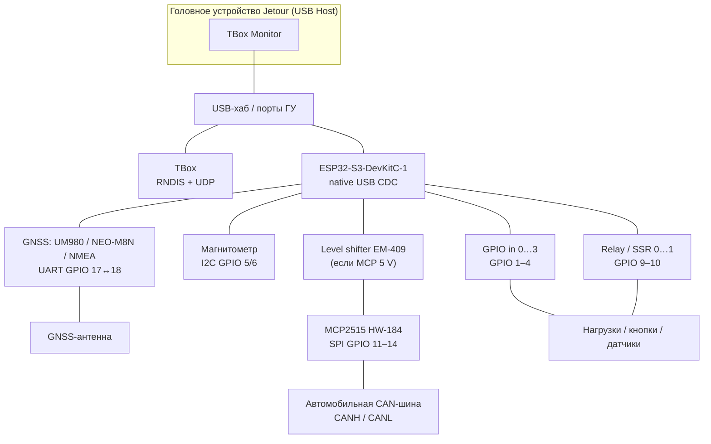
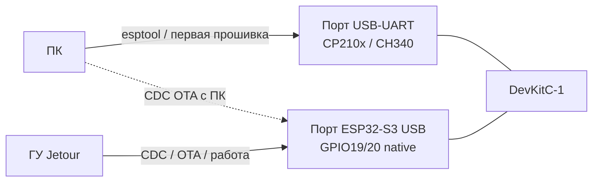
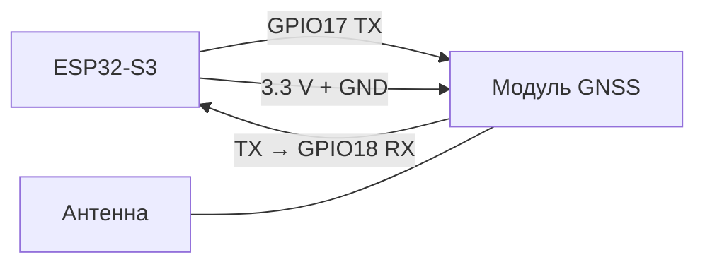
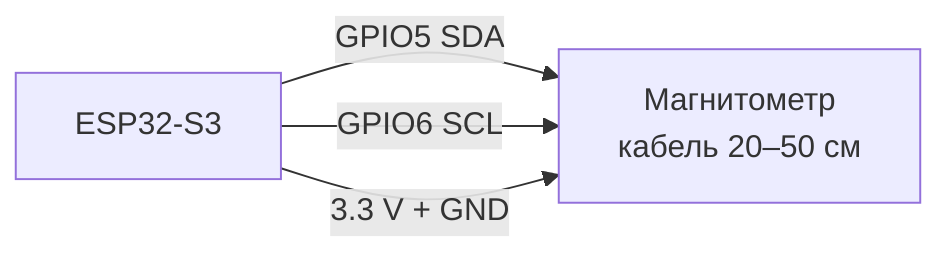
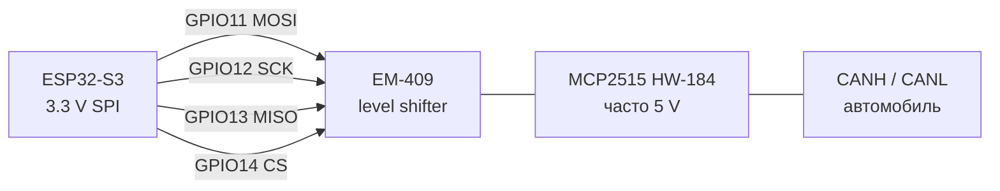
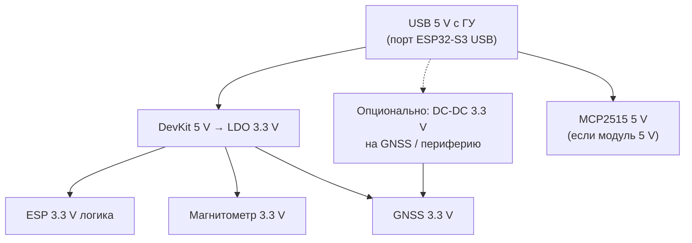

# Схема подключений компаньона ESP32-S3

Плата: **ESP32-S3-DevKitC-1** (N16R8 / N8R8). Прошивка: [`firmware/esp32-companion/`](../firmware/esp32-companion/).  
Протокол и pin-map: [ESP32_COMPANION_RU.md](ESP32_COMPANION_RU.md). Прошивка с ПК: [ESP32_COMPANION_FLASH_PC_RU.md](ESP32_COMPANION_FLASH_PC_RU.md).

## Обзор: кто с кем связан

На USB Host ГУ одновременно могут висеть **TBox** (RNDIS) и **компаньон** (Espressif CDC, VID `0x303A`). Это разные устройства; приложение ищет компаньон **только** по VID Espressif.



| Устройство | Интерфейс к ESP | Обязательно? |
|------------|-----------------|--------------|
| ГУ (USB Host) | Native **ESP32-S3 USB** (не UART-порт) | Да (работа с приложением) |
| GNSS (UM980 / u-blox / NMEA) | UART TX/RX + 3.3 V + GND | Опционально |
| GNSS-антенна | Разъём модуля GNSS | Для фикса |
| Магнитометр | I2C SDA/SCL + 3.3 V + GND | Опционально |
| MCP2515 (+ level shifter) | SPI + 5 V/3.3 V + GND → CANH/CANL | Опционально |
| Входы / реле | GPIO | Опционально |

---

## Два USB-порта DevKit — не перепутать



| Порт на плате | Куда кабель | Зачем |
|---------------|-------------|-------|
| **USB-UART** | ПК | Первая прошивка (`esptool` / `idf.py flash`) |
| **ESP32-S3 USB** | ГУ (или ПК для CDC OTA) | Работа с приложением, OTA с вкладки «Компаньон» |

---

## Полная pin-map (DevKitC-1)

```
                    ESP32-S3-DevKitC-1
                 ┌─────────────────────┐
   ГУ USB Host ──┤ ESP32-S3 USB        │
                 │   (native CDC)      │
                 │                     │
  GNSS TX ──────►│ GPIO18  UART RX     │
  GNSS RX ◄──────│ GPIO17  UART TX     │
  GNSS 3V3 / GND │                     │
                 │                     │
  Mag SDA ───────┤ GPIO5   I2C SDA     │
  Mag SCL ───────┤ GPIO6   I2C SCL     │
  Mag 3V3 / GND  │                     │
                 │                     │
  In0…3 ◄────────│ GPIO1…4  inputs     │
  Rel0…1 ────────►│ GPIO9…10 outputs    │
                 │                     │
  MCP MOSI ──────►│ GPIO11             │
  MCP SCK  ──────►│ GPIO12             │
  MCP MISO ◄──────│ GPIO13             │
  MCP CS   ──────►│ GPIO14             │
                 │                     │
  ПК flash ──────┤ USB-UART (отдельно) │
                 └─────────────────────┘
```

| Функция | GPIO | Направление | Примечание |
|---------|------|-------------|-----------|
| GNSS UART RX (ESP ← TX модуля) | **18** | вход | LVTTL 3.3 V |
| GNSS UART TX (ESP → RX модуля) | **17** | выход | |
| GPIO in 0…3 | **1, 2, 3, 4** | вход | internal pull-up; **active-low** (замкнуто на GND = «1») |
| Relay / SSR out 0…1 | **9, 10** | выход | HIGH = вкл.; старт LOW |
| MCP2515 MOSI | **11** | выход | через level shifter, если модуль 5 V |
| MCP2515 SCK | **12** | выход | |
| MCP2515 MISO | **13** | вход | |
| MCP2515 CS | **14** | выход | |
| Mag I2C SDA | **5** | I2C | 400 кГц |
| Mag I2C SCL | **6** | I2C | |
| USB D+/D− (native) | 19/20 | USB | к ГУ; не путать с USB-UART |

**Не подключать:** MCP2515 **INT** (прошивка опрашивает). Wi‑Fi/BT на компаньоне не включать рядом с магнитометром.

---

## 1. GNSS (UM980 / NEO-M8N / generic NMEA)



| Сигнал модуля | → DevKit |
|---------------|----------|
| TX | GPIO **18** (ESP RX) |
| RX | GPIO **17** (ESP TX) |
| VCC | **3.3 V** (не 5 V на VCC чипа) |
| GND | общий GND |

- UART: 8N1, по умолчанию **115200** (хранится в NVS; допустимы 9600…460800).
- fw **0.7.0+**: автоопределение UM980 / u-blox(NEO-M8N) / generic NMEA.
- Антенна — на разъём модуля (активная антенна увеличивает ток).
- Питание DevKit+UM980 с USB ГУ ~**0.3–0.5 A**; при нагреве LDO / просадках — отдельный **DC-DC 3.3 V** на GNSS, GND общий с DevKit.

---

## 2. Магнитометр (I2C)

Поддерживаются: **RM3100**, **MMC5983**, **IST8310**, **HMC5883L**, **HMC5983**, **QMC5883L** (автоопределение).



| Сигнал | GPIO / питание |
|--------|----------------|
| SDA | **5** |
| SCL | **6** |
| VCC | **3.3 V** |
| GND | общий |
| DRDY | не обязателен (v1 — опрос STATUS) |

- Модуль **на кабеле 20–50 см**, не на плате ESP (токи LDO/UART/CAN портят поле).
- Крепление жёстко к кузову, ближе к продольной оси; ось **X вперёд**.
- RM3100: линия **I2CEN = HIGH** (модули только SPI не подходят).
- Подтяжки I2C к 3.3 V — часто уже на модуле.
- Подробнее: [COMPASS_HEADING_PLAN_RU.md](COMPASS_HEADING_PLAN_RU.md).

---

## 3. CAN: MCP2515 (HW-184) + level shifter

Опционально. Кадры **не** смешиваются с mbCAN/VHAL ГУ — только консоль/лог на вкладке «Компаньон».



| ESP GPIO | Через shifter | MCP2515 |
|----------|---------------|---------|
| 11 MOSI | SI | SI |
| 12 SCK | SCK | SCK |
| 13 MISO | SO | SO |
| 14 CS | CS | CS |
| — | — | **INT не подключать** |

| Питание / шина | Значение |
|----------------|----------|
| Кварц модуля | **8 МГц** (по умолчанию в прошивке) |
| Битрейт | **500 кбит/с** (можно сменить с ГУ) |
| Модуль 5 V | VCC модуля = 5 V; SPI через **двунаправленный** преобразователь (напр. EM-409) |
| Модуль 3.3 V | level shifter не нужен; SPI напрямую |
| CAN | CANH / CANL к нужной шине; общий GND с автомобилем по правилам установки |

---

## 4. Дискретные входы (GPIO in 0…3)

| Канал | GPIO | Логика в прошивке |
|-------|------|-------------------|
| in 0 | 1 | pull-up; замыкание на **GND** = активный («1» в протоколе) |
| in 1 | 2 | то же |
| in 2 | 3 | то же |
| in 3 | 4 | то же |

Типично: кнопка / сухой контакт / open-collector между GPIO и GND. Debounce **30 ms**. Напряжение на пин — **только 3.3 V**-уровни (не 12 V авто без защиты).

---

## 5. Реле / SSR (out 0…1)

| Канал | GPIO | Уровень |
|-------|------|---------|
| relay 0 | 9 | HIGH = вкл. |
| relay 1 | 10 | HIGH = вкл. |

GPIO DevKit **не** тянет силовую нагрузку напрямую: ставьте модуль реле / SSR / драйвер с опторазвязкой, общий GND (или развязка по datasheet модуля). Управление из UI / автоматизаций / виджетов `espRelay0…1`.

---

## 6. Питание (сводка)



- Общий **GND** у DevKit, GNSS, магнитометра, SPI/MCP (и level shifter).
- Суммарный ток компаньона с USB ГУ обычно 0.3–0.5 A; активная антенна и MCP увеличивают потребление — следите за нагревом LDO DevKit.

---

## Минимальный набор vs полный

| Сценарий | Что подключить |
|----------|----------------|
| Только связь с ГУ / OTA | DevKit ← USB native → ГУ |
| Геопозиция через компаньон | + GNSS UART 17/18 + антенна + «Подключаться к компаньону» + источник «Компаньон» |
| Компас (телеметрия) | + магнитометр I2C 5/6 на выносном кабеле |
| CAN-консоль / лог | + MCP2515 (+ EM-409 при 5 V) → CANH/CANL |
| Автоматизации / виджеты GPIO | + входы 1–4 и/или реле 9–10 |

Связанные документы: протокол [ESP32_COMPANION_RU.md](ESP32_COMPANION_RU.md), прошивка с ПК [ESP32_COMPANION_FLASH_PC_RU.md](ESP32_COMPANION_FLASH_PC_RU.md), компас [COMPASS_HEADING_PLAN_RU.md](COMPASS_HEADING_PLAN_RU.md), пользовательский гайд [USER_GUIDE_RU.md](USER_GUIDE_RU.md) (вкладка «Компаньон»).
