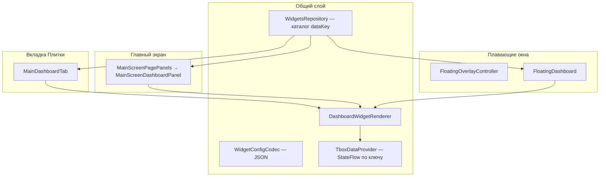

# Панели и виджеты (плитки)

Документ описывает три поверхности отображения **плиток** (виджетов) в TBox Monitor (**0.16.2**), общую модель данных и **как добавить новый виджет** в код.

Пользовательские шаги настройки — в [USER_GUIDE_RU.md](USER_GUIDE_RU.md) (§1.3–1.5, §1.4b для дня/ночи и регулировки зеркал). Экспорт панелей в темы — в [Themes.md](Themes.md).

Актуальное для 0.16.2: HVAC (вентилятор, температуры, обдув, SYNC), багажник, складывание/регулировка зеркал, тема день/ночь, SLA/знак ограничения скорости, stepper (громкость и HVAC), настраиваемый вид плитки (выравнивание, вес шрифта, положение заголовка, зазор сетки, отступы содержимого), шаг сетки панелей, описания типов в диалоге выбора.

---

## Три типа панелей

Все панели используют **одну модель плитки** (`FloatingDashboardWidgetConfig` + `DashboardWidget`) и **один рендерер** (`DashboardWidgetRenderer`). Отличаются размещение, хранение и режим редактирования.

| Поверхность | Пункт меню / экран | Класс UI | Ключ настроек |
|-------------|-------------------|----------|---------------|
| **Вкладка «Плитки»** | Левое меню → «Плитки» | `MainDashboardTab` | `dashboard_widgets`, `dashboard_rows`, `dashboard_cols` |
| **Панели главного экрана** | «Главная» | `MainScreenDashboardPanel` | `main_screen_dashboards` |
| **Плавающие панели** | Окна поверх приложений | `FloatingDashboard` + `FloatingOverlayController` | `floating_dashboards` |

«Меню плиток» в смысле **выбора типа данных** — это диалог `WidgetSelectionDialogForm`: радио-список из `WidgetsRepository.getAvailableDataKeysWidgets()`, а не отдельная панель.



---

## 1. Вкладка «Плитки» (Main Dashboard Tab)

**Назначение:** полноэкранная сетка плиток внутри приложения (пункт меню «Плитки»).

### Поведение

- Сетка: собственный цикл `Row`/`Column` в `MainDashboardTab` (отступ 8 dp).
- **Долгое нажатие** на ячейку сразу открывает диалог выбора виджета (отдельного «режима редактирования» нет).
- **Короткое нажатие** — действие виджета (запуск приложения, режим вождения, поездки и т.д.).
- Опционально **графики** на плитках (`dashboardChart` в настройках).
- Хранение: `List<FloatingDashboardWidgetConfig>` в `dashboard_widgets`; размер сетки — `dashboard_rows` / `dashboard_cols`.

### Настройка (UI)

**Настройки** → блок **«Настройки экрана Плитки»** → строки/столбцы → меню **«Плитки»** → долгое нажатие на ячейку.

---

## 2. Панели главного экрана

**Назначение:** одна или несколько панелей поверх **обоев** на вкладке «Главная».

### Поведение

- Каждая панель — `MainScreenPanelConfig`: **относительные** координаты и размер (`relX`, `relY`, `relWidth`, `relHeight`), привязка к **странице** (`pageNumber`), зазор сетки плиток (`gridSpacingDp`).
- Общая сетка: `DashboardPanelGridAndFrames`.
- **Долгое нажатие** по панели — режим редактирования (перетаскивание, изменение размера за угол; позиция/размер привязываются к **глобальному** `mainScreenPanelsLayoutSnapDp`, 1–50 dp, по умолчанию 1).
- **Короткое нажатие** на ячейку в режиме редактирования — диалог выбора плитки.
- Вкладка диалога **«Вся панель»**: имя, строки/столбцы, расстояние между плитками, страница, действие по клику, индикатор отключения TBox.
- Режим редактирования автоматически выключается через **5 минут**.

### Настройка (UI)

**Настройки главного экрана** → **«Панели главного экрана»** → добавить панель → **«Главная»** → долгое нажатие для редактирования. В разделе настроек панелей: расстояние между плитками (на выбранную панель) и **общий** шаг сетки для всех панелей ГЭ (не входит в темы).

---

## 3. Плавающие панели (overlay)

**Назначение:** системные окна `TYPE_APPLICATION_OVERLAY` поверх любых приложений.

### Поведение

- Управление: `FloatingOverlayController` в `BackgroundService` синхронизирует список `floating_dashboards` с `WindowManager`.
- Окно: `FLAG_NOT_FOCUSABLE`; контент — Compose в `FloatingDashboardUI`.
- Позиция и размер в **пикселях** (`startX`, `startY`, `width`, `height`); **глобальный** `floatingPanelsLayoutSnapDp` — шаг привязки при drag/resize всех плавающих панелей в режиме редактирования (ручной ввод px в настройках не снапится; в темы не входит).
- **Долгое нажатие** — режим редактирования (drag + resize).
- **Короткое нажатие** на ячейку в edit mode открывает диалог в **главном окне** `MainActivity` (overlay не может показать фокусируемый диалог).
- Видимость: флаг `enabled`, правила скрытия по foreground-приложению (Usage Stats: опрос ~3 с, смена fg принимается после 2 одинаковых опросов подряд; sync без reorder/fade и без немедленного ensure), временное скрытие виджетом «Скрыть плавающие панели».
- Порядок наложения — в **«Настройки плавающих панелей»** → «Порядок панелей».

### Настройка (UI)

**Настройки плавающих панелей** → добавить → разрешить «Поверх других окон» → задать размер в px, расстояние между плитками (на выбранную панель) и **общий** шаг сетки для всех плавающих панелей.

---

## Модель данных плитки

### Runtime (`DashboardWidget`)

Заголовок, единица, цвета, `dataKey` — для отрисовки.

### Persistence (`FloatingDashboardWidgetConfig`)

Сохраняется в JSON (общий для всех трёх типов панелей):

- `dataKey`, `showTitle`, `scale`, `shape`, цвета light/dark текста и фона плитки
- цвета элементов управления (опционально; `null` = дефолт виджета): `controlInactiveColorLight/Dark`, `controlActiveColorLight/Dark`, `controlInactiveBackgroundColorLight/Dark`, `controlActiveBackgroundColorLight/Dark`
- скругление контролов: `controlShape` (`null` = дефолт класса: music/stepper → 10, остальные → 0)
- отступы контента от краёв ячейки: `paddingTopPercent` / `paddingBottomPercent` / `paddingStartPercent` / `paddingEndPercent` (0–50 %, по умолчанию 0)
- `mediaPlayers` (музыка), `appWidgetId` (сторонний виджет Android)
- `launcherAppPackage` + опционально freeform: `launcherFreeformEnabled`, `launcherFreeformSide` (`left`/`right`/`top`/`bottom`), `launcherFreeformPercent` (20–80, шаг 10) — для ярлыка приложения
- `useMbCanVhal`, `httpRequestYaml`, поля поездки, `selectedDriveMode` и др.

Сериализация: `WidgetConfigCodec.kt`. Загрузка в runtime: `loadWidgetsFromConfig()`. Отступы применяются обёрткой `WidgetCellContentPadding` в сетке панели / вкладки «Плитки». Цвета контролов резолвятся в `WidgetControlAppearance` и прокидываются через `LocalWidgetControlAppearance`.

### Ярлык приложения: режим окна (freeform + overlay)

Не системный split-screen, а **freeform companion** (как farmerbb/Taskbar) плюс **отдельный overlay** с полноценным главным экраном TBox:

1. Якорь 1×1 (`FreeformInvisibleAnchorActivity`) + `setLaunchWindowingMode(5)` / `setLaunchBounds` для приложения-компаньона (координаты **виртуального / activity-дисплея** ГУ, не всей физической панели). Если выбран `displayId=0` (эмулятор / один экран), `setLaunchDisplayId` **не** вызывается — иначе на части образов freeform bounds сбрасываются в fullscreen. На inset app VD (`displayId≠0`) — `createDisplayContext` + `setLaunchDisplayId`.
2. Рядом — overlay с `MainScreen` (`FloatingOverlayController.showMainScreenWindow`):
   - по умолчанию **авто-геометрия**: complementary-прямоугольник рядом с companion в том же пространстве, что и freeform;
   - overlay вешается через `WindowManager` из `createDisplayContext` / `createWindowContext` для сохранённого `activityDisplayId` (`FreeformDisplaySpaces`): выбирается inset app VD (на Jetour обычно не `displayId=0`, а меньший VD вроде `5:1320×856`), иначе проценты считаются от «почти полного» экрана;
   - если авто выключено — геометрия из **Настройки главного экрана → Оконный режим** (компактные поля W/H и X/Y, как у плавающих панелей).
3. При входе в оконный режим **`MainActivity` закрывается** (broadcast `ACTION_FINISH_FOR_WINDOW_MODE`), чтобы не было двух экземпляров главной. Если пользователь снова вручную запускает `MainActivity`, пока overlay главного экрана ещё открыт, оконный режим завершается (overlay и якорь снимаются; companion force-stop не делается).
4. В overlay — две перемещаемые угловые кнопки (только в оконном режиме):
   - **×** — выход из оконного режима (снять overlay и якорь, сбросить сессию); `MainActivity` не поднимается;
   - **□** — то же плюс снова открыть fullscreen `MainActivity` (как прежнее поведение ×).
   Companion force-stop не делается. На fullscreen-главной эти кнопки не показываются.
5. Правила скрытия/показа плавающих панелей по Usage Stats продолжают работать и в оконном режиме (с debounce и безопасным sync). Смена foreground сама по себе оконный режим не закрывает.
6. Смена companion (другой ярлык с оконным режимом): полный выход из оконного режима (как кнопка закрытия: снять overlay и якорь, без MainActivity), пауза settle, затем запуск нового companion. Предыдущее приложение force-stop не делается.
7. Повторный тап по **тому же** ярлыку с оконным режимом: снова запускает companion в freeform и показывает overlay главного экрана, если его сейчас нет (`showMainScreenWindow` идемпотентен — второго overlay не создаёт). Выход из режима только кнопками overlay (**×** / **□**), не повторным тапом ярлыка.

Требуется freeform на ГУ. Код: `freeform/FreeformLaunchHelper.kt`, `FreeformDisplaySpaces`, `FreeformLaunchBounds`, `FreeformCompanionSession`, `MainScreenWindowOverlayUI`, `BackgroundService` `ACTION_SHOW/HIDE_MAIN_SCREEN_WINDOW`.

---

## Диалог выбора плитки

Три обёртки над общим `WidgetSelectionDialogForm`:

| Диалог | Где вызывается | Сохранение |
|--------|----------------|------------|
| `WidgetSelectionDialog` | Вкладка «Плитки» | `saveDashboardWidgets` |
| `MainScreenPanelWidgetSelectionDialog` | Главный экран | `saveMainScreenDashboardWidgets` |
| `FloatingOverlayFloatingPanelWidgetSelectionDialog` | Редактирование overlay | `saveFloatingDashboardWidgets` |

Вкладки диалога:

1. **Список типов** — `WidgetsRepository.getAvailableDataKeysWidgets()` + поиск.
2. **Дополнительно** — заголовок, цвета плитки (сегмент Светлая/Тёмная), блок **элементов управления** (переключатель «Цвета по умолчанию», сегмент Неактивное/Активное в паре с темой, цвет иконки/фона контрола, скругление контролов), масштаб, скругление плитки, опции по типу виджета.
3. **Вся панель** — только для панелей главного экрана и floating (не для вкладки «Плитки» в том же виде).

Глобальная палитра пресетов цвета в редакторе: **8** слотов (`SettingsManager.WIDGET_COLOR_PRESET_SLOT_COUNT`), включая типовые голубой `#2180F3` и оранжевый `#F3A721`.

### Сторонний виджет Android

`dataKey = externalAppWidget`. Выбор через `WidgetPickerActivity` (`ACTION_APPWIDGET_PICK`), не через радио-список. Рендер: `ExternalAppWidgetItem` + `AppWidgetHost`.

---

## Виджеты, пишущие Settings (день/ночь и регулировка зеркал)

| Виджет | Код | Куда пишет | Разрешения |
|--------|-----|------------|------------|
| **Тема день/ночь** (Android 9) | `HeadUnitDayNightRepository` | `Settings.Global` `com.mb.provider.night_mode_auto` (+ чтение `DAY_NIGHT_STATUS`) | `WRITE_SECURE_SETTINGS` (+ доступ «Изменение системных настроек») |
| **Тема день/ночь** (Android 10 / Adayo) | `HeadUnitDayNightRepository` | `auto_skin` / `adayo_skin`; ручное — `com.adayo.launcher.SET_THEME`; авто — broadcast `com.adayo.auto.theme` | то же (`WRITE_SECURE_SETTINGS`) |
| **Регулировка зеркал** (Android 9) | `MirrorAdjustModeRepository` | `Settings.Global` (`ro.mb.mirror.adjust.mode`) | то же |
| **Регулировка зеркал** (Android 10) | `MirrorAdjustModeRepository` | `Settings.System` (`mirrorAdjustment`) | `WRITE_SETTINGS` (вкл. в UI Android) + `WRITE_SECURE_SETTINGS` по ADB |

**Порядок выдачи прав (обязательно оба шага):**

1. В настройках Android включите для **TBox Monitor** доступ к **изменению системных настроек**.
2. Выполните ADB:

```
adb shell pm grant vad.dashing.tbox android.permission.WRITE_SECURE_SETTINGS
```

Разрешения объявлены в `AndroidManifest.xml`. Без них плитки показывают состояние, но запись в штатные ключи не проходит. Виджет **«Складывание зеркал»** идет через mbCAN/VHAL и этих прав не требует.

Пользовательские шаги: [USER_GUIDE_RU.md](USER_GUIDE_RU.md) §1.4b.

---

## Рендеринг

`DashboardWidgetRenderer` — центральный `when (widget.dataKey)`:

- **Кастомные** ветки: музыка (полный и «только кнопки» H/V), поездка, режим вождения, HTTP-запрос, климат, сиденья и т.д.
- **`else`** → `DashboardWidgetItem` — универсальная плитка «заголовок + значение» из `TboxDataProvider`.

Источники данных:

| Тип | Откуда значение |
|-----|-----------------|
| Телеметрия TBox | `TboxDataProvider` → `TboxRepository` / `CanDataRepository` |
| mbCAN / VHAL | `UniversalCanRepository` (если `useMbCanVhal` или интерактивный виджет) |
| Составные | `DashboardCompositeTileFlowKeys` |

Интерактивные виджеты (климат, сиденья) регистрируют интересы CAN через `UniversalCanRepository.setSourceWidgetKeys` при появлении на видимой панели (`DashboardPanelGridAndFrames`).

### Сворачивание панели (W-11)

Во вкладке «Вся панель» можно задать край свайпа, толщину полоски, цвета полоски в свёрнутом и развёрнутом состоянии (light/dark) и авто-сворачивание по одиночному или двойному тапу (включая внутренние кнопки плитки) с задержкой 0–10 с (только если выбран край сворачивания). Свёрнутое состояние хранится в DataStore (`panel_collapse_states`, map `panelId → bool`) **независимо от темы**. Плавающий overlay при сворачивании сжимается до полоски.

---

## Как добавить новый виджет (разработчик)

Регистрации **нет** как единого плагина — изменения в **4–6 местах** в зависимости от сложности.

### Случай A: простая плитка «значение с шины»

Пример: новое поле из `CanDataRepository`.

1. **Ключ** — константа `MY_WIDGET_DATA_KEY = "myWidget"` (в `*Widget.kt` или рядом с доменом).
2. **Строки** — `data_title_my_widget` (+ unit), `widget_desc_my_widget` и, для
   интерактивной плитки, `widget_actions_my_widget` в `res/values/strings.xml` и flavor `en`.
3. **Каталог** — записи в `WidgetsRepository.dataKeyTitlesWidgets` и
   `widgetDescriptions` (`ViewModels.kt`).
4. **Данные** — ветка в `TboxDataProvider.createFlowForKey()`.
5. **Флаги возможностей** — при необходимости `supportsShowUnit`, `supportsValueAccuracy`, `supportsUseMbCanVhal` и т.д.
6. **Рендерер** — обычно **не нужен** (сработает `else` → `DashboardWidgetItem`).
7. **Клик** — только если нужно действие: обработчики в `MainDashboardTab`, `MainScreenDashboardPanel`, `FloatingDashboard`.
8. **Тест** — round-trip в `WidgetConfigCodec*Test`, если добавлены поля конфига.

### Случай B: кастомный UI или интерактив

Дополнительно к шагам A:

1. **`ui/DashboardMyWidget.kt`** — composable `DashboardMyWidgetItem` на базе `DashboardWidgetScaffold`.
2. **Ветка** в `DashboardWidgetRenderer.when`.
3. **Поля конфига** — расширить `FloatingDashboardWidgetConfig`, `WidgetConfigCodec`, `WidgetSelectionDialogState`, `applyWidgetSelectionChanges()`.
4. **mbCAN** — при необходимости ключ в `WidgetsRepository.supportsUseMbCanVhal` и сигналы в `MbCanSignal`.

### Случай C: сторонний App Widget

Отдельный код UI не нужен. Пользователь выбирает тип «Сторонний виджет» → `WidgetPickerActivity`.

---

## Индикаторы на плитках

**Настройки** → **«Настройки виджетов для Overlays»**:

| Индикатор | Цвета |
|-----------|--------|
| **TBox** | Красный — нет службы; жёлтый — нет связи с TBox; зелёный — OK |
| **Геопозиция** | Красный — нет фикса; жёлтый — расхождение скоростей; зелёный — OK |

На панели можно включить **индикатор отключения TBox** (полоска/маркер на всей панели).

---

## Связь с темами

Экспорт `.tboxtheme` включает:

- `mainScreen` — все панели главного экрана с плитками;
- `floatingPanels` — все плавающие панели.

См. [Themes.md](Themes.md).

---

## Связанные файлы

| Область | Файлы |
|---------|--------|
| Модель и каталог | `Settings.kt`, `ViewModels.kt` (`WidgetsRepository`), `WidgetConfigCodec.kt` |
| Рендер | `ui/DashboardWidgetRenderer.kt`, `ui/DataProvider.kt`, `ui/Dashboard*.kt` |
| Вкладка «Плитки» | `ui/DashboardTab.kt` |
| Главный экран | `ui/MainScreenPagePanels.kt`, `ui/MainScreenDashboardPanel.kt` |
| Floating | `FloatingOverlayController.kt`, `ui/FloatingDashboard.kt` |
| Диалоги | `ui/WidgetSelectionDialogShared.kt`, `WidgetPickerActivity.kt` |
| Сохранение | `SettingsViewModels.kt` |

---

## См. также

- [TBOX_PROXY_RU.md](TBOX_PROXY_RU.md) — данные TBox для плиток
- [CAN_BACKENDS_RU.md](CAN_BACKENDS_RU.md) — mbCAN/VHAL и `useMbCanVhal`
- [Themes.md](Themes.md) — перенос панелей в `.tboxtheme`
- [Trips.md](Trips.md) — виджеты поездок
