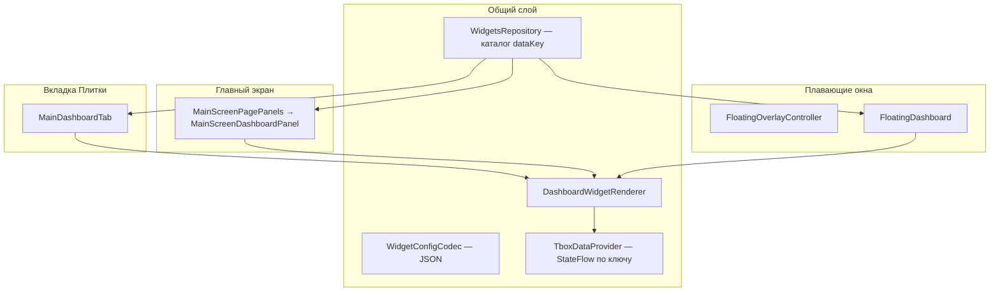

# Панели и виджеты (плитки)

Документ описывает три поверхности отображения **плиток** (виджетов) в TBox Monitor, общую модель данных и **как добавить новый виджет** в код.

Пользовательские шаги настройки — в [USER_GUIDE_RU.md](USER_GUIDE_RU.md) (§1.3–1.5). Экспорт панелей в темы — в [Themes.md](Themes.md).

---

## Три типа панелей

Все панели используют **одну модель плитки** (`FloatingDashboardWidgetConfig` + `DashboardWidget`) и **один рендерер** (`DashboardWidgetRenderer`). Отличаются размещение, хранение и режим редактирования.

| Поверхность | Пункт меню / экран | Класс UI | Ключ настроек |
|-------------|-------------------|----------|---------------|
| **Вкладка «Плитки»** | Левое меню → «Плитки» | `MainDashboardTab` | `dashboard_widgets`, `dashboard_rows`, `dashboard_cols` |
| **Панели главного экрана** | «Главная» | `MainScreenDashboardPanel` | `main_screen_dashboards` |
| **Плавающие панели** | Окна поверх приложений | `FloatingDashboard` + `FloatingOverlayController` | `floating_dashboards` |

«Меню плиток» в смысле **выбора типа данных** — это диалог `WidgetSelectionDialogForm`: радио-список из `WidgetsRepository.getAvailableDataKeysWidgets()`, а не отдельная панель.

---

## 1. Вкладка «Плитки» (Main Dashboard Tab)

**Назначение:** полноэкранная сетка плиток внутри приложения (пункт меню «Плитки»).

### Поведение

- Сетка: собственный цикл `Row`/`Column` в `MainDashboardTab` (отступ 8 dp).
- **Долгое нажатие** на ячейку сразу открывает диалог выбора виджета (отдельного «режима редактирования» нет).
- **Короткое нажатие** — действие виджета (запуск приложения, режим вождения, поездки и т.д.).
- Опционально **графики** на плитках (`dashboardChart` в настройках).
- Хранение: `List<FloatingDashboardWidgetConfig>` в `dashboard_widgets`; размер сетки — `dashboard_rows` / `dashboard_cols`.

### Настройка (UI)

**Настройки** → блок **«Настройки экрана Плитки»** → строки/столбцы → меню **«Плитки»** → долгое нажатие на ячейку.

---

## 2. Панели главного экрана

**Назначение:** одна или несколько панелей поверх **обоев** на вкладке «Главная».

### Поведение

- Каждая панель — `MainScreenPanelConfig`: **относительные** координаты и размер (`relX`, `relY`, `relWidth`, `relHeight`), привязка к **странице** (`pageNumber`).
- Общая сетка: `DashboardPanelGridAndFrames`.
- **Долгое нажатие** по панели — режим редактирования (перетаскивание, изменение размера за угол).
- **Короткое нажатие** на ячейку в режиме редактирования — диалог выбора плитки.
- Вкладка диалога **«Вся панель»**: имя, строки/столбцы, страница, действие по клику, индикатор отключения TBox.
- Режим редактирования автоматически выключается через **5 минут**.

### Настройка (UI)

**Настройки главного экрана** → **«Панели главного экрана»** → добавить панель → **«Главная»** → долгое нажатие для редактирования.

---

## 3. Плавающие панели (overlay)

**Назначение:** системные окна `TYPE_APPLICATION_OVERLAY` поверх любых приложений.

### Поведение

- Управление: `FloatingOverlayController` в `BackgroundService` синхронизирует список `floating_dashboards` с `WindowManager`.
- Окно: `FLAG_NOT_FOCUSABLE`; контент — Compose в `FloatingDashboardUI`.
- Позиция и размер в **пикселях** (`startX`, `startY`, `width`, `height`).
- **Долгое нажатие** — режим редактирования (drag + resize).
- **Короткое нажатие** на ячейку в edit mode открывает диалог в **главном окне** `MainActivity` (overlay не может показать фокусируемый диалог).
- Видимость: флаг `enabled`, правила скрытия по foreground-приложению, временное скрытие виджетом «Скрыть плавающие панели».
- Порядок наложения — в **«Настройки плавающих панелей»** → «Порядок панелей».

### Настройка (UI)

**Настройки плавающих панелей** → добавить → разрешить «Поверх других окон» → задать размер в px и сетку.

---

## Модель данных плитки

### Runtime (`DashboardWidget`)

Заголовок, единица, цвета, `dataKey` — для отрисовки.

### Persistence (`FloatingDashboardWidgetConfig`)

Сохраняется в JSON (общий для всех трёх типов панелей):

- `dataKey`, `showTitle`, `scale`, `shape`, цвета light/dark
- `mediaPlayers` (музыка), `appWidgetId` (сторонний виджет Android)
- `useMbCanVhal`, `httpRequestYaml`, поля поездки, `selectedDriveMode` и др.

Сериализация: `WidgetConfigCodec.kt`. Загрузка в runtime: `loadWidgetsFromConfig()`.

---

## Диалог выбора плитки

Три обёртки над общим `WidgetSelectionDialogForm`:

| Диалог | Где вызывается | Сохранение |
|--------|----------------|------------|
| `WidgetSelectionDialog` | Вкладка «Плитки» | `saveDashboardWidgets` |
| `MainScreenPanelWidgetSelectionDialog` | Главный экран | `saveMainScreenDashboardWidgets` |
| `FloatingOverlayFloatingPanelWidgetSelectionDialog` | Редактирование overlay | `saveFloatingDashboardWidgets` |

Вкладки диалога:

1. **Список типов** — `WidgetsRepository.getAvailableDataKeysWidgets()` + поиск.
2. **Дополнительно** — заголовок, цвета, масштаб, скругление, опции по типу виджета.
3. **Вся панель** — только для панелей главного экрана и floating (не для вкладки «Плитки» в том же виде).

### Сторонний виджет Android

`dataKey = externalAppWidget`. Выбор через `WidgetPickerActivity` (`ACTION_APPWIDGET_PICK`), не через радио-список. Рендер: `ExternalAppWidgetItem` + `AppWidgetHost`.

---

## Рендеринг

`DashboardWidgetRenderer` — центральный `when (widget.dataKey)`:

- **Кастомные** ветки: музыка, поездка, режим вождения, HTTP-запрос, климат, сиденья и т.д.
- **`else`** → `DashboardWidgetItem` — универсальная плитка «заголовок + значение» из `TboxDataProvider`.

Источники данных:

| Тип | Откуда значение |
|-----|-----------------|
| Телеметрия TBox | `TboxDataProvider` → `TboxRepository` / `CanDataRepository` |
| mbCAN / VHAL | `UniversalCanRepository` (если `useMbCanVhal` или интерактивный виджет) |
| Составные | `DashboardCompositeTileFlowKeys` |

Интерактивные виджеты (климат, сиденья) регистрируют интересы CAN через `UniversalCanRepository.setSourceWidgetKeys` при появлении на видимой панели (`DashboardPanelGridAndFrames`).

---

## Как добавить новый виджет (разработчик)

Регистрации **нет** как единого плагина — изменения в **4–6 местах** в зависимости от сложности.

### Случай A: простая плитка «значение с шины»

Пример: новое поле из `CanDataRepository`.

1. **Ключ** — константа `MY_WIDGET_DATA_KEY = "myWidget"` (в `*Widget.kt` или рядом с доменом).
2. **Строки** — `data_title_my_widget` (+ unit) в `res/values/strings.xml` и flavor `en`.
3. **Каталог** — запись в `WidgetsRepository.dataKeyTitlesWidgets` (`ViewModels.kt`).
4. **Данные** — ветка в `TboxDataProvider.createFlowForKey()`.
5. **Флаги возможностей** — при необходимости `supportsShowUnit`, `supportsValueAccuracy`, `supportsUseMbCanVhal` и т.д.
6. **Рендерер** — обычно **не нужен** (сработает `else` → `DashboardWidgetItem`).
7. **Клик** — только если нужно действие: обработчики в `MainDashboardTab`, `MainScreenDashboardPanel`, `FloatingDashboard`.
8. **Тест** — round-trip в `WidgetConfigCodec*Test`, если добавлены поля конфига.

### Случай B: кастомный UI или интерактив

Дополнительно к шагам A:

1. **`ui/DashboardMyWidget.kt`** — composable `DashboardMyWidgetItem` на базе `DashboardWidgetScaffold`.
2. **Ветка** в `DashboardWidgetRenderer.when`.
3. **Поля конфига** — расширить `FloatingDashboardWidgetConfig`, `WidgetConfigCodec`, `WidgetSelectionDialogState`, `applyWidgetSelectionChanges()`.
4. **mbCAN** — при необходимости ключ в `WidgetsRepository.supportsUseMbCanVhal` и сигналы в `MbCanSignal`.

### Случай C: сторонний App Widget

Отдельный код UI не нужен. Пользователь выбирает тип «Сторонний виджет» → `WidgetPickerActivity`.

---

## Индикаторы на плитках

**Настройки** → **«Настройки виджетов для Overlays»**:

| Индикатор | Цвета |
|-----------|--------|
| **TBox** | Красный — нет службы; жёлтый — нет связи с TBox; зелёный — OK |
| **Геопозиция** | Красный — нет фикса; жёлтый — расхождение скоростей; зелёный — OK |

На панели можно включить **индикатор отключения TBox** (полоска/маркер на всей панели).

---

## Связь с темами

Экспорт `.tboxtheme` включает:

- `mainScreen` — все панели главного экрана с плитками;
- `floatingPanels` — все плавающие панели.

См. [Themes.md](Themes.md).

---

## Связанные файлы

| Область | Файлы |
|---------|--------|
| Модель и каталог | `Settings.kt`, `ViewModels.kt` (`WidgetsRepository`), `WidgetConfigCodec.kt` |
| Рендер | `ui/DashboardWidgetRenderer.kt`, `ui/DataProvider.kt`, `ui/Dashboard*.kt` |
| Вкладка «Плитки» | `ui/DashboardTab.kt` |
| Главный экран | `ui/MainScreenPagePanels.kt`, `ui/MainScreenDashboardPanel.kt` |
| Floating | `FloatingOverlayController.kt`, `ui/FloatingDashboard.kt` |
| Диалоги | `ui/WidgetSelectionDialogShared.kt`, `WidgetPickerActivity.kt` |
| Сохранение | `SettingsViewModels.kt` |

---

## См. также

- [TBOX_PROXY_RU.md](TBOX_PROXY_RU.md) — данные TBox для плиток
- [CAN_BACKENDS_RU.md](CAN_BACKENDS_RU.md) — mbCAN/VHAL и `useMbCanVhal`
- [Themes.md](Themes.md) — перенос панелей в `.tboxtheme`
- [Trips.md](Trips.md) — виджеты поездок
