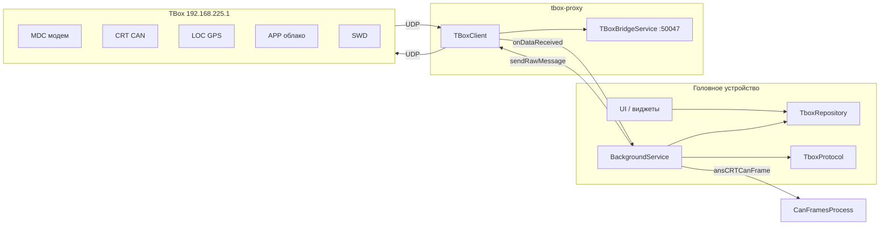

# TBox и tbox-proxy: обмен данными

Документ описывает, как приложение **TBox Monitor** на головном устройстве (ГУ) обменивается данными с блоком **TBox** Jetour Dashing. Транспорт — **UDP** через библиотеку **[tbox-proxy](https://github.com/jsparrow2006/tbox-proxy)** (зависимость `com.github.jsparrow2006:tbox-proxy`).

Пользовательские сценарии (модем, перезагрузки, настройки) — в [USER_GUIDE_RU.md](USER_GUIDE_RU.md). CAN с шины ГУ (mbCAN / VHAL) — отдельный путь, см. [CAN_BACKENDS_RU.md](CAN_BACKENDS_RU.md).

---

## Роли компонентов

| Компонент | Где | Назначение |
|-----------|-----|------------|
| **TBox** (ARM) | `192.168.225.1` | Модем, CAN-шлюз (CRT), GPS (LOC), облако (APP), watchdog (SWD) |
| **tbox-proxy** | Библиотека + `TBoxBridgeService` | Единственный владелец UDP-сокета на порту **50047** |
| **`BackgroundService`** | Приложение | Протокол, команды, парсинг, поездки/топливо |
| **`TboxRepository`** | Singleton | `StateFlow` для UI, виджетов и broadcast-подписчиков |
| **`TboxProtocol`** | Утилиты | Заголовок пакета, XOR-контрольная сумма |
| **`CanFramesProcess`** | Утилиты | Декод CAN-кадров из ответа CRT → `CanDataRepository` |



**Важно:** UI **не** открывает UDP напрямую. Все запросы идут через `BackgroundService` → `TBoxClient.sendRawMessage()`.

---

## Сеть

| Параметр | Значение | Константа / место |
|----------|----------|-------------------|
| IP TBox | `192.168.225.1` | `BackgroundService.DEFAULT_TBOX_IP` |
| UDP-порт TBox | `50047` | `serverPort`, `NOTIFICATION_ID` |
| Идентификатор ГУ на шине | `0x50` | `SELF_CODE` |

Библиотека tbox-proxy дополнительно использует локальный порт и TCP для IPC между процессами (см. README tbox-proxy). Приложение эти параметры не переопределяет.

---

## Формат пакета (`TboxProtocol`)

Структура: **13 байт заголовка** + **payload** + **1 байт XOR**.

| Смещение | Поле |
|----------|------|
| 0–1 | Магия `0x8E 0x5D` |
| 2–3 | Общая длина (payload + 10), big-endian |
| 6 | Версия протокола `0x01` |
| 8 | **TID** — целевой модуль TBox |
| 9 | **SID** — источник (у ГУ всегда `0x50`) |
| 10–11 | Длина payload, big-endian |
| 12 | **CMD** — команда |
| 13… | Payload |
| последний | XOR байтов с индекса 9 |

Исходящий путь: `fillHeader` → payload → `xorSum`. Входящий: `checkPacket` → `extractData` (с проверкой XOR).

---

## Модули TBox (TID)

| Код | Имя | Назначение в приложении |
|-----|-----|-------------------------|
| `0x23` | **CRT** | CAN-кадры, DID, перезагрузка TBox, напряжения |
| `0x25` | **MDC** | Состояние сети, APN, AT-команды |
| `0x29` | **LOC** | Подписка и данные GPS |
| `0x2D` | **SWD** | Запрет лишних перезагрузок |
| `0x2F` | **APP** | Suspend / Resume / Stop облачного приложения |
| `0x37` | **GATE** | Версия proxy/gate |
| `0x50` | *(SELF)* | Идентификатор клиента на ГУ |

Также определены, но почти не используются: `NTM (0x24)`, `HUM (0x30)`, `UDA (0x38)`.

---

## Команды (основные)

Ответ обычно имеет CMD = запрос **| 0x80**.

| CMD | Направление | Смысл |
|-----|-------------|--------|
| `0x01` | → / ← | VERSION |
| `0x02` | → | SUSPEND процесса |
| `0x03` | → | RESUME |
| `0x04` | → | STOP |
| `0x05` | → LOC | Подписка на GPS |
| `0x07` | → MDC | Опрос состояния сети → ответ `0x87` |
| `0x0E` | → MDC | AT-туннель → ответ `0x8E` |
| `0x10` | → MDC | Управление APN |
| `0x11` | → MDC | Запрос состояния APN → `0x91` |
| `0x15` | → CRT | Запрос CAN-кадра → `0x95` |
| `0x2B` | → CRT | Перезагрузка TBox |

---

## Жизненный цикл связи

### Старт службы

1. Загрузка поездок и настроек с диска.
2. `connectTboxClient()` — создание `TBoxClient`, `initialize()`.
3. Фоновые задачи: опрос сети (5 с), APN (10 с), проверка связи, watchdog переподключения, периодика 1 с.
4. `startDataListener()` — учёт поездок, топлива, моторных часов (использует CAN из TBox и отдельно mbCAN/VHAL).

### Подключение (два уровня)

1. **Библиотека:** `onConnectionChanged(connected)` — мост tbox-proxy поднят/упал.
2. **Приложение:** `TboxRepository.tboxConnected` — `true` после первого валидного пакета; `false` при обрыве или **3 подряд** проверках без пакетов дольше `netUpdateTime × 2` (~10 с по умолчанию).

### Переподключение

`startTboxClientReconnectWatchdog()`: интервалы **60 → 120 → 600 → 600** с, с **60 с** grace после старта службы.

### При установлении связи (`onTboxConnected(true)`)

По настройкам автоматически могут выполняться: SUSPEND/STOP для APP/MDC/SWD/LOC, `swdPreventRestart`, подписка CAN (`crtGetCanFrame`), подписка LOC, запрос версий модулей.

---

## Поток данных

### Исходящие

```
Intent / периодика → sendTboxMessage(tid, sid=SELF, cmd, payload)
  → fillHeader + xorSum → tBoxClient.sendRawMessage (mutex, timeout 1 с)
```

### Входящие

```
onDataReceived → поток tbox-packet-processor → responseWork(packet)
  → ans* по TID/CMD → TboxRepository.update* → ViewModels → UI
```

### CAN из TBox

Ответ CRT `0x95` (`ansCRTCanFrame`) → сырой blob CAN → `CanFramesProcess.process()` → `CanDataRepository` (скорость, RPM, топливо %, шины и т.д.).

Декодирование **включено** только если в настройках включено **«Получать данные CAN»** (`getCanFrame`). Отфильтрованный % и калиброванные литры — дополнительный gate по **активной поездке** (см. [fuel-refuels-calibration.md](fuel-refuels-calibration.md)).

### GPS

`ansLOCValues` — структура ~39 байт: статус, UTC, lat/lon/alt, спутники, скорость, курс. Флаг `isLocValuesTrue` может сверять скорость GPS со скоростью CAN.

### Модем

- Периодический `MDC 0x07` каждые **5 с**; после 2 пропусков — сброс `netState`.
- APN — каждые **10 с** при регистрации в домашней/роуминговой сети.

---

## UI и внешние подписчики

| Путь | Описание |
|------|----------|
| **ViewModels** | Читают `TboxRepository` StateFlow |
| **Intent → Service** | AT, модем, перезагрузка TBox, SUSPEND/STOP, `ACTION_GET_INFO` |
| **`TboxBroadcastSender`** | Рассылка выбранных значений сторонним приложениям через `TBoxBroadcastReceiver` |

Индикатор TBox на плитках: зелёный / жёлтый / красный по `tboxConnected` и состоянию службы (см. [PANELS_AND_WIDGETS_RU.md](PANELS_AND_WIDGETS_RU.md)).

---

## Два источника CAN

Данные с машины могут приходить **двумя независимыми путями**:

| Источник | Транспорт | Типичные поля |
|----------|-----------|---------------|
| **TBox CRT** | UDP → `CanFramesProcess` | Скорость, RPM, топливо %, одометр, давление шин, температура снаружи |
| **ГУ mbCAN / VHAL** | Локальный API ГУ | Климат, сиденья, режим вождения, громкость, опционально RPM/скорость/температура (`useMbCanVhal`) |

Виджеты по умолчанию берут телеметрию с **TBox CAN**. Для части виджетов в «Дополнительно» можно включить **«Использовать mbCAN/VHAL»** — тогда данные идут через `UniversalCanRepository`.

---

## Связанные файлы (для разработчика)

| Область | Файлы |
|---------|--------|
| Служба и протокол | `BackgroundService.kt`, `TboxProtocol.kt` |
| Состояние | `TboxRepository.kt`, `CanDataRepository.kt` |
| Декод CAN | `utils/CanFramesProcess.kt` |
| Зависимость | `gradle/libs.versions.toml` → `tboxProxy` |
| Broadcast | `TboxBroadcastSender.kt`, `TBoxBroadcastReceiver.kt` |
| Boot | `BootCompleteReceiver.kt` |

---

## См. также

- [USER_GUIDE_RU.md](USER_GUIDE_RU.md) — интерфейс, программы TBox, перезагрузки
- [CAN_BACKENDS_RU.md](CAN_BACKENDS_RU.md) — mbCAN и VHAL на ГУ
- [PANELS_AND_WIDGETS_RU.md](PANELS_AND_WIDGETS_RU.md) — плитки и источники данных
- [Trips.md](Trips.md) — поездки и учёт топлива по CAN TBox
