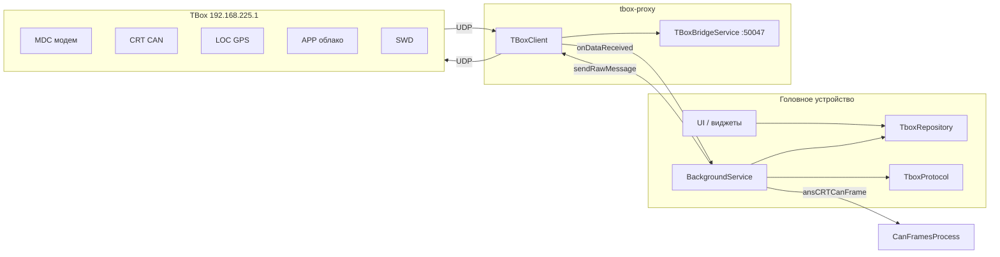

# TBox и tbox-proxy: обмен данными

Документ описывает, как приложение **TBox Monitor** на головном устройстве (ГУ) обменивается данными с блоком **TBox** Jetour Dashing. Транспорт — **UDP** через библиотеку **[tbox-proxy](https://github.com/jsparrow2006/tbox-proxy)** (зависимость `com.github.jsparrow2006:tbox-proxy`).

Пользовательские сценарии (модем, перезагрузки, настройки) — в [USER_GUIDE_RU.md](USER_GUIDE_RU.md). CAN с шины ГУ (mbCAN / VHAL) — отдельный путь, см. [CAN_BACKENDS_RU.md](CAN_BACKENDS_RU.md).

---

## Роли компонентов

| Компонент | Где | Назначение |
|-----------|-----|------------|
| **TBox** (ARM) | `192.168.225.1` | Модем, CAN-шлюз (CRT), GPS (LOC), облако (APP), watchdog (SWD) |
| **tbox-proxy** | Библиотека + `TBoxBridgeService` | Единственный владелец UDP-сокета на порту **50047** |
| **`BackgroundService`** | Приложение | Протокол, команды, парсинг, поездки/топливо |
| **`TboxRepository`** | Singleton | `StateFlow` для UI, виджетов и broadcast-подписчиков |
| **`TboxProtocol`** | Утилиты | Заголовок пакета, XOR-контрольная сумма |
| **`CanFramesProcess`** | Утилиты | Декод CAN-кадров из ответа CRT → `CanDataRepository` |


```mermaid
flowchart LR
  subgraph HU["Головное устройство"]
    UI["UI / виджеты"]
    BS["BackgroundService"]
    TR["TboxRepository"]
    UI --> TR
    BS --> TR
    BS --> TP["TboxProtocol"]
  end

  subgraph Proxy["tbox-proxy"]
    TC["TBoxClient"]
    TBS["TBoxBridgeService :50047"]
    TC --> TBS
  end

  subgraph TBox["TBox 192.168.225.1"]
    MDC["MDC модем"]
    CRT["CRT CAN"]
    LOC["LOC GPS"]
    APP["APP облако"]
    SWD["SWD"]
  end

  BS -->|sendRawMessage| TC
  TC -->|UDP| TBox
  TBox -->|UDP| TC
  TC -->|onDataReceived| BS
  BS -->|ansCRTCanFrame| CFP["CanFramesProcess"]
```

**Важно:** UI **не** открывает UDP напрямую. Все запросы идут через `BackgroundService` → `TBoxClient.sendRawMessage()`.

---

## Сеть

| Параметр | Значение | Константа / место |
|----------|----------|-------------------|
| IP TBox | `192.168.225.1` | `BackgroundService.DEFAULT_TBOX_IP` |
| UDP-порт TBox | `50047` | `serverPort`, `NOTIFICATION_ID` |
| Идентификатор ГУ на шине | `0x50` | `SELF_CODE` |

Библиотека tbox-proxy дополнительно использует локальный порт и TCP для IPC между процессами (см. README tbox-proxy). Приложение эти параметры не переопределяет.

### ADB к TBox (вкладка «ADB»)

TBox — **составное** USB-устройство: системный **RNDIS** (сеть `192.168.225.1`) и отдельно интерфейс **ADB** (`0xFF/0x42/0x01`).

На ГУ Adayo закрытие `UsbDeviceConnection` (usbfs FD) для этого композита может отвязать системный RNDIS и оборвать UDP-связь приложения с TBox. Вкладка «ADB» поэтому:

- claim ADB-интерфейса с `force=false` (без `usb_detach_kernel_driver` у соседнего RNDIS);
- при Disconnect на RNDIS+ADB **не закрывает** usbfs FD — только `releaseInterface`, дескриптор держится для повторного подключения (поведение ближе к Bugjaeger по USB);
- при физическом DETACH **не вызывает** `releaseInterface`/`close` на уже мёртвом handle (на части OEM это даёт native crash) — только сбрасывает park;
- DETACH учитывается и во время CONNECTING (`activeUsbDeviceId`); `bulkTransfer`/`claimInterface` обёрнуты в `runCatching`; протухший park не `close()`-ится.

TCP-режим (`127.0.0.1:5555` и т.п.) — отдельно, для shell на самом ГУ; к TBox по USB используйте USB-режим.

---

## Формат пакета (`TboxProtocol`)

Структура: **13 байт заголовка** + **payload** + **1 байт XOR**.

| Смещение | Поле |
|----------|------|
| 0–1 | Магия `0x8E 0x5D` |
| 2–3 | Общая длина (payload + 10), big-endian |
| 6 | Версия протокола `0x01` |
| 8 | **TID** — целевой модуль TBox |
| 9 | **SID** — источник (у ГУ всегда `0x50`) |
| 10–11 | Длина payload, big-endian |
| 12 | **CMD** — команда |
| 13… | Payload |
| последний | XOR байтов с индекса 9 |

Исходящий путь: `fillHeader` → payload → `xorSum`. Входящий: `checkPacket` → `extractData` (с проверкой XOR).

---

## Модули TBox (TID)

| Код | Имя | Назначение в приложении |
|-----|-----|-------------------------|
| `0x23` | **CRT** | CAN-кадры, DID, перезагрузка TBox, напряжения |
| `0x25` | **MDC** | Состояние сети, APN, AT-команды |
| `0x29` | **LOC** | Подписка и данные GPS |
| `0x2D` | **SWD** | Запрет лишних перезагрузок |
| `0x2F` | **APP** | Suspend / Resume / Stop облачного приложения |
| `0x37` | **GATE** | Версия proxy/gate |
| `0x38` | **UDA** | Диагностика UDS/DTC (DiagReq), FOTA |
| `0x50` | *(SELF)* | Идентификатор клиента на ГУ |

Также определены, но почти не используются: `NTM (0x24)`, `HUM (0x30)`.

### UDA (TID `0x38`) — DTC / диагностика

Модуль `ydsapp/run/uda`. Таблица команд (`Uda_Msg_Table`):

| CMD | Ответ | Смысл |
|-----|-------|--------|
| `0x01` | `0x81` | VERSION |
| `0x02`/`0x03`/`0x04` | `0x82`… | SUSPEND / RESUME / STOP |
| `0x05` | `0x85` (+ async `0x86`/`0x8a`/`0x8b`) | **DiagReq** (ReadDtc / ClearDtc / ReadDid / WriteDid) |
| `0x07` | `0x87` (+ `0x88`) | FotaReq |
| `0x09` | `0x89` | AbortReq |
| `0x28`/`0x29` | — | CanTP PassThrough / Ctrl |

DiagReq payload (см. `UdaProtocol.kt`): путь к `libJX65_n720_CFG.so` + type @`0x84` + ecuParam @`0x85` + dataLen @`0x89` + data @`0x8d`.

В UI: «Запросить информацию» читает VERSION UDA; в эксперт-режиме на вкладке Info — кнопка Read DTC probe.

### CRT CMD `0x26` — vctrl (MCU)

APP шлёт удалённое управление как CRT `0x26` с кадром **45 байт** (`yds_mq_vctrl_sendto_mcu`).
`frame[0]` = **`TSP.RemoteControlCmdType`** (имена из `RemoteControlCmdType_names` /
`entries_by_number` в `app`). CRT пробрасывает cmds `0x20…0x3F` на MCU — ГУ может
слать те же кадры напрямую (в обход APP jump table).

Хелпер: `CrtVctrlProtocol` в `uda/UdaProtocol.kt`.

**Layout кадра (APP `recv_cmd_vctrl`):** `[0]=opcode`, `[1..8]` TSP id/time,
**`[9]=param0`** у простых команд (on/off/mode). `FIND_VEHICLE` дополнительно
пишет `[10]`/`[11]`.

**Jump table:** `cmp opcode,#0x67` / `ldrls pc,[pc,r1,lsl#2]`. Non-DEFAULT arm
пакует поля и ставит кадр в очередь; **DEFAULT = early return, MCU не шлётся**.
Список PACK: `CrtVctrlProtocol.APP_PACKED_OPCODES`.

**`IsValid`:** валидны `0x00…0x1F`, `0x32…0x3B`, `0x64…0x67`, `200…201`.
Имена `ENGINE…GREENCABIN_MANUAL` (`0x20…0x2F`) есть в enum-таблице имён, но
`RemoteControlCmdType_IsValid` их отвергает.

| Opcode | Имя (proto) | APP jump | Примечание |
|--------|-------------|----------|------------|
| `0x00` | WINDOWS | PACK | `frame[9]` |
| `0x01` | GET_TBOX_LOG | PACK | несколько байт с `frame[9]` |
| `0x02` | FRONT_LIGHT | PACK | Monitor `ACTION_CLOSE`/`OPEN` → off/on `@[9]` |
| `0x03` | AIR_CONDETION_LEVEL | PACK | typo в proto |
| `0x04` | SECNE_CTRL | PACK | typo: SCENE |
| `0x05` | DEFROSTING | PACK | `@[9]` |
| `0x06` | LIGHT_SHOW_CTRL | PACK | `@[9]` |
| `0x07` | CLEAN_FAULT_CODE | PACK | `@[9]` (общий handler с `0x08`/`0x32…`) |
| `0x08` | POWER_ON_OFF | PACK | `@[9]` |
| `0x09` | FIND_VEHICLE | PACK | `@[9..11]` |
| `0x0A` | SEAT_VEN | PACK | `@[9]` |
| `0x0B` | QUERY_CERTIFIVCATE | PACK | typo: CERTIFICATE |
| `0x0C` | WRITE_CONFIG_CODE | DEFAULT | |
| `0x0D` | DIGITAL_KEY_CONTROL | DEFAULT | |
| `0x0E` | ACTION_TEST | PACK | |
| `0x0F` | AIR_CONDITION_CTRL | PACK | |
| `0x10` | AUTOAIR_TIMELY | DEFAULT | |
| `0x11` | TRUNK_DOOR | PACK | |
| `0x12` | GET_ECU_CONF_CODE | PACK | |
| `0x13` | VEHICLE_EXAM | DEFAULT | |
| `0x14` | LOCK | DEFAULT | не путать с Monitor OPEN/CLOSE |
| `0x15` | LIGHT_SHOW_MODEL | PACK | |
| `0x16` | WINDOW_ALL | PACK | |
| `0x17` | ELE_FENCE | PACK | |
| `0x18` | DOWNLOAD_CERTIFICATE | PACK | |
| `0x19` | QUERY_ECUINFO | PACK | |
| `0x1A` | AIR_CONDITION | PACK | |
| `0x1B` | KEY_UPDATE | PACK | |
| `0x1C` | SEAT | DEFAULT | |
| `0x1D` | STERILIZE | PACK | |
| `0x1E` | WRITE_VIN | PACK | `@[9]` |
| `0x1F` | GET_CAN_STREAM | DEFAULT | |
| `0x20` | ENGINE | DEFAULT | + `IsValid=false` |
| `0x21` | ROOF_WINDOW | DEFAULT | + `IsValid=false` |
| `0x22` | RESET_ECU | DEFAULT | + `IsValid=false` |
| `0x23` | GREENCABIN_AUTO | DEFAULT | + `IsValid=false` |
| `0x24` | AIR_PURIFIER | DEFAULT | + `IsValid=false` |
| `0x25` | AUTO_AIR_CONDITION_CTRL | DEFAULT | + `IsValid=false` |
| `0x26` | REPID_COOLING | DEFAULT | typo RAPID; + `IsValid=false` |
| `0x27` | MANUALAIR_TIMELY | DEFAULT | + `IsValid=false` |
| `0x28` | REMOTE_DIAG | DEFAULT | + `IsValid=false` |
| `0x29` | REPID_HEATING | DEFAULT | + `IsValid=false` |
| `0x2A` | CHARGE_RESERVE | DEFAULT | + `IsValid=false` |
| `0x2B` | POWER_PHEV | DEFAULT | + `IsValid=false` |
| `0x2C` | AIR_CONDITION_CTRL_MODE | DEFAULT | + `IsValid=false` |
| `0x2D` | STEERING_WHEEL_HEATING | DEFAULT | + `IsValid=false` |
| `0x2E` | HU_AWAKEN | DEFAULT | + `IsValid=false` |
| `0x2F` | GREENCABIN_MANUAL | DEFAULT | + `IsValid=false` |
| `0x32…0x3A` | *(без имени)* | PACK | `0x37`/`0x39` — отдельные handlers |
| `0x64`/`0x65`/`0x67` | *(без имени)* | PACK | `0x66` — DEFAULT |

**MCU firmware (`TBOX_VP.bin`, 1 MiB):** образ VP на **RH850F1K** (`R7F7015813`),
стек `Core_V3_0_10` / JX65 (`CanFD/rscan`, CanTp, Dcm). Копия:
`ydsdata/bakup/TBOX_VP.bin` (= `D:\Tools\1\Dashing\CAN\TBOX_VP.bin`).

Кадр 45 байт кладётся в `buf+5`; switch по `frame[0]` (`cmp ≤0x3A`, JT `@0x9E008`).

| Opcode | MCU handler | Наблюдение |
|--------|-------------|------------|
| `0x02` FRONT_LIGHT | active | Com **`0x183`** → IPdu **`0x39`** → CAN **`0x315`** bits `[10:11]`; param`1`→val`1`, param`0`→val`2` |
| `0x14` LOCK | **nop** (`dispose`) | как APP DEFAULT; BLE — отдельный remap |
| `0x20` ENGINE | **nop** на этом path | лог `VCTRL_TYPE_ENGINE` есть у handler `0x00` / BLE |
| `0x00…0x0A`, `0x18`, `0x1A`, `0x1E`, `0x32…36/38…3A` | active | Com ids кластера `0x180…0x1C2` |
| прочие named | shared dispose | см. `CrtVctrlProtocol.MCU_ACTIVE_OPCODES` |

### FRONT_LIGHT → Com / CAN (VP Com-таблицы)

В `TBOX_VP.bin` нет ASCII-имён `Com_Tx_*` (символы сострижены). Привязка по
дескриптору сигнала и таблице IPdu:

| Поле | Значение | Где в образе |
|------|----------|--------------|
| Logical name | **`FRONT_LIGHT`** (= VCTL opcode / `RemoteControlCmdType`) | — |
| ComSignalId | **`0x183`** | handler `@0x9E264` (`MOVEA`); record `@0x6d640`; ptr table `@0x71a48[0x183]`→`@0x6d648` |
| ComIPduHandleId | **`0x39`** | поле record+0 |
| Bit layout | start **10**, end **11**, len **2** | record+8…+12 |
| CAN ID / DLC | **`0x315`**, DLC **8** | Com IPdu table `@0x6307c` entry `[0x39]` (+28 = CanId) |
| Values | on=`1`, off=`2` | VCTL param `@[9]` → Com set |

Соседи того же IPdu `0x39` / CAN `0x315` (другие VCTL Com ids): `0x181…0x18b`
(биты 3…63). IPdu `0x38` → CAN `0x301` (только `0x180`); `0x3A` → CAN `0x320`.

В MCU также VCTL-логи `lock/windows/dwm/trunk/findcar/engine ctrl success` (в т.ч. BLE
`recv_BleVctrlCmd`, JT 1…0x16). Предварительный разбор CRT `0x15`/`0x16` — в
`D:\Tools\1\Dashing\CAN\`; старый `TBOX_VP_bin_analysis.md` ошибочно считал образ
«дампом» и частоту байт `0x10…0x17` командами CRT.

---

## Команды (основные)

Ответ обычно имеет CMD = запрос **| 0x80**.

| CMD | Направление | Смысл |
|-----|-------------|--------|
| `0x01` | → / ← | VERSION |
| `0x02` | → | SUSPEND процесса |
| `0x03` | → | RESUME |
| `0x04` | → | STOP |
| `0x05` | → LOC | Подписка на GPS |
| `0x07` | → MDC | Опрос состояния сети → ответ `0x87` |
| `0x0E` | → MDC | AT-туннель → ответ `0x8E` |
| `0x10` | → MDC | Управление APN |
| `0x11` | → MDC | Запрос состояния APN → `0x91` |
| `0x15` | → CRT | Запрос CAN-кадра → `0x95` |
| `0x2B` | → CRT | Перезагрузка TBox |

---

## Жизненный цикл связи

### Старт службы

1. Загрузка поездок и настроек с диска.
2. `connectTboxClient()` — создание `TBoxClient`, `initialize()`.
3. Фоновые задачи: опрос сети (5 с), APN (10 с), проверка связи, watchdog переподключения, периодика 1 с.
4. `startDataListener()` — учёт поездок, топлива, моторных часов (использует CAN из TBox и отдельно mbCAN/VHAL).

### Подключение (два уровня)

1. **Библиотека:** `onConnectionChanged(connected)` — мост tbox-proxy поднят/упал.
2. **Приложение:** `TboxRepository.tboxConnected` — `true` после первого валидного пакета; `false` при обрыве или **3 подряд** проверках без пакетов дольше `netUpdateTime × 2` (~10 с по умолчанию).

Пока сессия «connected», периодика раз в **5 с** шлёт **SWD VERSION** (UDP keep-alive). Ответ любого модуля обновляет `lastPacketAtMs`; SWD выбран потому, что обычно не останавливается (в отличие от APP/MDC). Это особенно важно, когда опрос MDC net/APN выключен (источник модема Wi‑Fi HTTP) и нет потока LOC/CAN.

### Переподключение

`startTboxClientReconnectWatchdog()`: интервалы **60 → 120 → 600 → 600** с, с **60 с** grace после старта службы.

### Режим «Не подключаться к TBox» (`no_tbox_connect`)

Настройка в DataStore (`SettingsManager.noTboxConnectFlow`, по умолчанию **выкл.**). При **вкл.**:

- служба **не** вызывает `connectTboxClient` / reconnect watchdog / опрос сети и APN / check connection / CRT `get_can_frame`; mid-session переключение — `disconnectTboxClient`;
- вкладки AT / CAN / Данные авто отключаются и блокируются в меню; вкладка **Модем** включается (Wi‑Fi модем без TBox); источник гео **TBox** недоступен (при включении режима, если был TBox — принудительно **Android**); источник модема **TBox** недоступен (если был TBox — принудительно **Wi‑Fi модем**);
- в пикере плиток скрыты типы, которые работают только через UDP/CDR (напряжение, точная скорость, КПП, netWidget*, restartTbox и др. — см. `WidgetsRepository.requiresTboxConnection`); уже добавленные плитки не удаляются;
- для новых/вставленных/импортированных из темы eligible-плиток по умолчанию включается **«Работа через CAN»** (`useMbCanVhal`);
- подвал меню не показывает статус TBox и версию tbox-proxy; рамки «TBox отключён» на панелях не рисуются; FG-уведомление нейтральное;
- `TboxBroadcastSender` по-прежнему может слать `connected=false` и пустые CDR-extras — это ожидаемо.

При **выкл.** восстанавливаются connect/proxy и типы в пикере; вкладки меню сами не включаются; `useMbCanVhal` не сбрасывается. При флаге выкл. поведение связи — как до этой настройки.

### При установлении связи (`onTboxConnected(true)`)

По настройкам автоматически могут выполняться: SUSPEND/STOP для APP/MDC/SWD/LOC, `swdPreventRestart`, подписка CAN (`crtGetCanFrame`), подписка LOC, запрос версий модулей.

---

## Поток данных

### Исходящие

```
Intent / периодика → sendTboxMessage(tid, sid=SELF, cmd, payload)
  → fillHeader + xorSum → tBoxClient.sendRawMessage (mutex, timeout 1 с)
```

### Входящие

```
onDataReceived → поток tbox-packet-processor → responseWork(packet)
  → ans* по TID/CMD → TboxRepository.update* → ViewModels → UI
```

### CAN из TBox

Ответ CRT `0x95` (`ansCRTCanFrame`) → сырой blob CAN → `CanFramesProcess.process()` → `CanDataRepository` (скорость, RPM, топливо %, шины и т.д.).

Декодирование **включено** только если в настройках включено **«Получать данные CAN»** (`getCanFrame`). Отфильтрованный % и калиброванные литры — дополнительный gate по **активной поездке** (см. [fuel-refuels-calibration.md](fuel-refuels-calibration.md)).

### GPS

`ansLOCValues` — payload после 6-байтного заголовка. Формат зависит от прошивки LOC:

| Формат | Как распознать | Декод |
|--------|----------------|--------|
| **Бинарный** (классика) | не начинается с `$` | ~39 байт LE: статус, UTC, lat/lon/alt, спутники, скорость, курс (`LocPayloadParser.parseBinary`) |
| **NMEA** (часть версий TBox) | тело начинается с `$GNRMC` / `$GNGGA` / … | разбор ASCII-предложений целиком, без обрезки до 39 байт (`LocPayloadParser.parseNmea`) |

Раньше всегда брался срез `[6, 45)` и читался как бинарный — на NMEA-прошивках строка «Сырые данные» обрезалась, а координаты получались мусором. Флаг `isLocValuesTrue` по-прежнему может сверять скорость GPS со скоростью CAN.

### Модем

- Периодический `MDC 0x07` каждые **5 с**; после 2 пропусков — сброс `netState`.
- APN — каждые **10 с** при регистрации в домашней/роуминговой сети.

---

## UI и внешние подписчики

| Путь | Описание |
|------|----------|
| **ViewModels** | Читают `TboxRepository` StateFlow |
| **Intent → Service** | AT, модем, перезагрузка TBox, SUSPEND/STOP, `ACTION_GET_INFO` |
| **`TboxBroadcastSender`** | Рассылка выбранных значений сторонним приложениям через `TBoxBroadcastReceiver` |

Индикатор TBox на плитках: зелёный / жёлтый / красный по `tboxConnected` и состоянию службы (см. [PANELS_AND_WIDGETS_RU.md](PANELS_AND_WIDGETS_RU.md)).

---

## Два источника CAN

Данные с машины могут приходить **двумя независимыми путями**:

| Источник | Транспорт | Типичные поля |
|----------|-----------|---------------|
| **TBox CRT** | UDP → `CanFramesProcess` | Скорость, RPM, топливо %, одометр, давление шин, температура снаружи |
| **ГУ mbCAN / VHAL** | Локальный API ГУ | Климат, сиденья, режим вождения, громкость, опционально RPM/скорость/температура (`useMbCanVhal`) |

Виджеты по умолчанию берут телеметрию с **TBox CAN**. Для части виджетов в «Дополнительно» можно включить **«Использовать mbCAN/VHAL»** — тогда данные идут через `UniversalCanRepository`.

---

## Связанные файлы (для разработчика)

| Область | Файлы |
|---------|--------|
| Служба и протокол | `BackgroundService.kt`, `TboxProtocol.kt` |
| Состояние | `TboxRepository.kt`, `CanDataRepository.kt` |
| Декод CAN | `utils/CanFramesProcess.kt` |
| Формулы raw→физ. | [RAW_VALUE_FORMULAS_RU.md](RAW_VALUE_FORMULAS_RU.md) |
| Зависимость | `gradle/libs.versions.toml` → `tboxProxy` |
| Broadcast | `TboxBroadcastSender.kt`, `TBoxBroadcastReceiver.kt` |
| Boot | `BootCompleteReceiver.kt` |

---

## См. также

- [USER_GUIDE_RU.md](USER_GUIDE_RU.md) — интерфейс и предотвращение лишних перезагрузок TBox
- [CAN_BACKENDS_RU.md](CAN_BACKENDS_RU.md) — mbCAN и VHAL на ГУ
- [RAW_VALUE_FORMULAS_RU.md](RAW_VALUE_FORMULAS_RU.md) — формулы пересчёта сырых значений
- [PANELS_AND_WIDGETS_RU.md](PANELS_AND_WIDGETS_RU.md) — плитки и источники данных
- [Trips.md](Trips.md) — поездки и учёт топлива по CAN TBox
