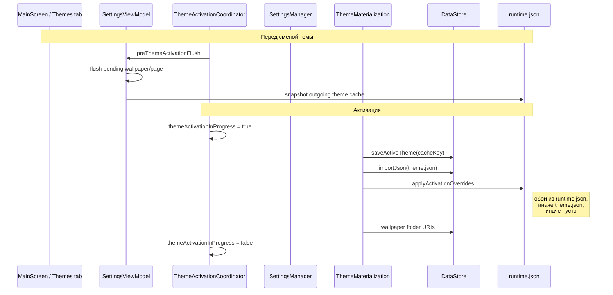
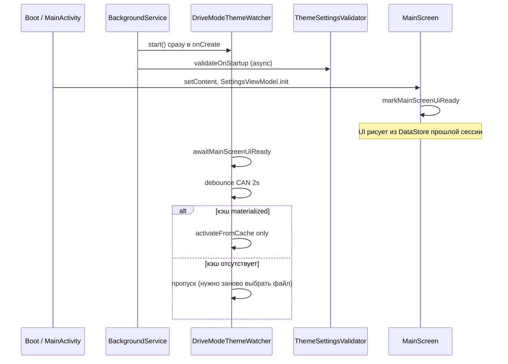

# Темы: как это работает

Документ описывает вкладку **«Темы»** в левом меню, формат файла `.tboxtheme`, материализованный кэш на диске, **runtime-состояние** (`runtime.json`), глобальные настройки в DataStore и автоматическое переключение тем по **режиму вождения**.

Для разработчиков в конце — цепочки вызовов, классы и известные ограничения.

---

## Зачем нужны темы

Тема — это переносимый набор настроек оформления и раскладки интерфейса. Её можно:

- **сохранить** в файл `.tboxtheme` и передать на другое ГУ;
- **применить** из файла одним действием;
- **назначить** отдельному режиму вождения (ECO, SPORT и т.д.), чтобы оформление менялось автоматически при переключении режима на машине.

Темы **не заменяют** резервную копию JSON: это отдельный механизм с собственным форматом и кэшем на диске.

---

## Два независимых слоя «темы»

В приложении не смешивать два разных понятия:

| Слой | Что переключается | Откуда сигнал | Где хранится |
|------|-------------------|---------------|--------------|
| **Светлая/тёмная тема ГУ** | Палитра Material, какая папка обоев light/dark, цвета кнопок на главном экране | `ThemeObserver` в `BackgroundService` → `TboxRepository.currentTheme` (1 = light, 2 = dark) | Только в памяти (не в `.tboxtheme`) |
| **TBox theme bundle** (`.tboxtheme`) | Панели, плитки, обои, иконки, число страниц, позиции кнопок | Ручное применение, intent, `DriveModeThemeWatcher` по CAN | DataStore + `files/themes/{cacheKey}/` |

Переключение ECO/NOR/SPT — это **второй** слой. Переключение день/ночь на головном устройстве — **первый**; оно влияет на то, из какой подпапки `wallpaper/light` или `wallpaper/dark` читаются обои и какие цвета берутся из настроек темы.

---

## Архитектура хранения состояния

У каждой материализованной темы три уровня данных:

```
┌─────────────────────────────────────────────────────────────────┐
│  DataStore (глобально, одно на всё приложение)                  │
│  • active_theme_uri          → cacheKey активной темы           │
│  • main_screen_wallpaper_*   → URI папок обоев light/dark       │
│  • main_screen_wallpaper_selection_by_page                      │
│  • main_screen_current_page, main_screen_page_count, panels…    │
│  • drive_mode_theme_paths    → { rawValue → URI .tboxtheme }    │
└─────────────────────────────────────────────────────────────────┘
         ▲ записывается при активации и при правках UI
         │ читается главным экраном напрямую
         ▼
┌─────────────────────────────────────────────────────────────────┐
│  files/themes/{cacheKey}/  (per-theme кэш на диске)            │
│  • manifest.json     — метаданные materialize                     │
│  • theme.json        — снимок при экспорте / первой распаковке   │
│  • runtime.json      — живое состояние темы (обои, страница)    │
│  • wallpaper/light|dark/, icons/, tile_backgrounds/             │
└─────────────────────────────────────────────────────────────────┘
```

### `theme.json` vs `runtime.json`

| Файл | Когда создаётся | Когда меняется | Роль при активации |
|------|-----------------|----------------|-------------------|
| **`theme.json`** | Materialize (распаковка ZIP) | Повторный apply/sync того же ключа | Импорт панелей, цветов, pageCount; дефолтные обои, если нет runtime |
| **`runtime.json`** | Первый materialize (`seedFromThemeJsonIfMissing`) или первая запись UI | Свайп обоев, смена страницы, snapshot при смене темы | **Приоритет** над `theme.json` для обоев и `currentPage` |

**Важно:** существующий `runtime.json` при повторной materialize **не перезаписывается** целиком — только точечно через `ThemeRuntimeState.patch` (merge).

Схема `runtime.json`:

```json
{
  "wallpaperSelectionByPage": {
    "light": { "1": "wallpaper_a.jpg" },
    "dark":  { "1": "wallpaper_b.jpg" }
  },
  "currentPage": 1
}
```

---

## Где в интерфейсе

Вкладка **«Темы»** (`themes`) в левом меню — по умолчанию включена. Расположена после **«Настройки плавающих панелей»** и перед **«Настройки главного экрана»**.

На вкладке доступны:

| Элемент | Действие |
|---------|----------|
| **Создать тему** | Экспорт выбранных разделов в файл `.tboxtheme` |
| **Текущая тема** | Имя активной темы (из кэша) |
| **Применить тему** | Выбор файла `.tboxtheme` → материализация и активация |
| **Открыть из файлового менеджера** | Файл `.tboxtheme` через «Открыть с помощью» → диалог подтверждения |
| **Очистить папку тем** | Удаление кэшей, кроме текущей активной темы; сброс назначений по режимам |
| **Темы по режиму вождения** | Назначение файла темы на каждый режим |

---

## Файл `.tboxtheme`

Расширение: **`tboxtheme`**. По сути это ZIP-архив:

```
theme.json
assets/wallpaper/light/
assets/wallpaper/dark/
assets/icons/
assets/tile_backgrounds/
```

### `theme.json`

| Поле | Значение |
|------|----------|
| `formatVersion` | `1` |
| `type` | `"tbox_theme"` |
| `exportedAtMillis` | время экспорта |
| `sections` | массив включённых разделов |
| `mainScreen` | настройки главного экрана (если раздел включён) |
| `floatingPanels` | плавающие панели |
| `appIcons` | пакеты с кастомными иконками |

В `mainScreen` могут быть `wallpaperSelectionByPage` и `currentPage` — они попадают в `runtime.json` при первой materialize (seed), если файла runtime ещё нет.

### Разделы темы (`sections`)

#### 1. `mainScreen`

Страницы, визуальная тема (фон холста, угловые кнопки, обрезка обоев), позиции кнопок, **все панели главного экрана** с плитками, выбранные файлы обоев.

#### 2. `floatingPanels`

Все плавающие панели: сетка, размер, позиция, плитки.

#### 3. `appIcons`

PNG для виджетов «Ярлык приложения». В кэше: `files/themes/{cacheKey}/icons/{packageName}`.

### Иконки и фоны плиток (два уровня путей)

**Иконки** — приоритет: кэш активной темы → `files/launcher_app_icons/` → системная.

**Фоны плиток** — приоритет: `files/themes/{cacheKey}/tile_backgrounds/` → `files/tile_backgrounds/` → только цвет.

При активации темы файлы **не копируются** в общие папки — виджеты читают пути из кэша активной темы.

---

## Materialize и Activate — два этапа

| Этап | Скорость | Что делает |
|------|----------|------------|
| **Materialize** | Медленно (IO, ZIP) | Распаковка в `files/themes/{cacheKey}/`, запись `theme.json`, `manifest.json`, assets; seed `runtime.json` если его ещё нет |
| **Activate** | Быстро | Импорт `theme.json` в DataStore, `applyActivationOverrides` из `runtime.json`, URI папок обоев, bump ревизий UI |

### Когда происходит materialize (распаковка ZIP)

| Триггер | Materialize | Activate |
|---------|-------------|----------|
| **«Выбрать файл»** для режима вождения (`assignDriveModeTheme`) | **Да** (при первом назначении; при повторном — sync) | Нет |
| **«Применить тему»** вручную (`ThemeApply.applyFromUri`) | **Да** (sync, если кэш уже есть) | Да |
| **Drive-mode watcher** при смене CAN | **Нет** | Да, только если кэш уже materialized |
| **Холодный старт приложения** | **Нет** | Только если watcher сработал по CAN |

**Контракт:** ZIP распаковывается при **выборе/применении файла**. При последующих запусках и при переключении режима на машине используется **готовый кэш**. Если папки `files/themes/drive_mode_*` нет (удалили вручную, импортировали backup без кэша), watcher **не** распаковывает архив сам — нужно снова **«Выбрать файл»** для режима на вкладке «Темы».

Повторное ручное применение того же `.tboxtheme` — это **sync-materialize**: `theme.json` и `manifest.json` обновляются; файлы с тем же именем в assets не перезаписываются; лишние в кэше удаляются.

---

## Цепочка активации темы

Все пути активации проходят через `ThemeActivationCoordinator.runWithThemeActivation` (process-wide mutex и флаг).



### Порядок в `activateFromCacheLocked`

1. `seedFromThemeJsonIfMissing` — создать `runtime.json` из `theme.json`, если файла нет.
2. `saveActiveTheme` — записать `active_theme_uri` (cache key) в DataStore.
3. `ThemeLayoutExport.importJson` — панели, pageCount, цвета, кнопки; `currentPage` из `theme.json`.
4. **`ThemeRuntimeState.applyActivationOverrides`** — **всегда** перезаписать `main_screen_wallpaper_selection_by_page` в DataStore:
   - из `runtime.json`, если есть секция обоев;
   - иначе из `theme.json` `mainScreen.wallpaperSelectionByPage`;
   - иначе **пусто** (старые обои предыдущей темы в DataStore **не** сохраняются).
5. При наличии `currentPage` в `runtime.json` — переопределить страницу в DataStore.
6. `applyWallpaperDirsFromCache` — `file://…/wallpaper/light|dark`.
7. Bump ревизий обоев, иконок, фонов плиток.

### `ThemeActivationCoordinator`

Синглтон на весь процесс (важно: `SettingsManager` создаётся отдельно в `MainActivity` и `BackgroundService`, но координатор **общий**):

| Поле / метод | Назначение |
|--------------|------------|
| `themeActivationInProgressFlow` | UI не рисует file-backed обои/иконки/фоны во время смены темы |
| `preThemeActivationFlush` | Регистрируется в `SettingsViewModel.init`; сбрасывает pending-правки в outgoing `runtime.json` |
| `mainScreenWallpaperRevisionFlow` | Epoch для перезагрузки списка обоев (общий для UI и сервиса) |
| `markMainScreenUiReady` / `awaitMainScreenUiReady` | Watcher ждёт готовности UI перед первой активацией |

Пока `themeActivationInProgress == true`:

- `MainScreen` не рисует обои, очищает bitmap cache;
- виджеты: `suppressCustomIcon` / не рисуют фоны плиток;
- `scheduleSaveMainScreenWallpaperSelection` не принимает новые правки.

---

## Обои на главном экране: UI → DataStore → runtime.json

### Отображение

```
effectiveSelection = combine(
  DataStore.main_screen_wallpaper_selection_by_page,
  pendingWallpaperPatches   // оптимистичный overlay в ViewModel
)
```

Свайп обоев сразу меняет UI через pending; запись на диск — с debounce **500 ms**.

### Сохранение

1. `scheduleSaveMainScreenWallpaperSelection` — добавить patch, запустить debounce.
2. `flushMainScreenWallpaperSelectionInternal`:
   - собрать merged из DataStore + patches;
   - записать в DataStore;
   - `syncActiveThemeWallpaperSelectionReliable` → `runtime.json` (с одной повторной попыткой);
   - дождаться подтверждения из DataStore flow;
   - только then очистить pending (иначе мигание после свайпа).

### Когда вызывается flush

| Событие | Flush обоев и страницы |
|---------|------------------------|
| Debounce 500 ms после свайпа | Да |
| `Lifecycle.Event.ON_STOP` Activity (уход в фон) | Да |
| **`DisposableEffect.onDispose`** при уходе с вкладки главного экрана | Да |
| `preThemeActivationFlush` перед сменой темы | Да |
| Переход на вкладку консоли **без** dispose (не применимо — MainScreen снимается с дерева) | Через `onDispose` |

При уходе в консоль/настройки **внутри приложения** срабатывает `onDispose` у `MainScreen`, а не только `ON_STOP` Activity — это гарантирует запись даже если debounce не успел.

### Синхронизация в кэш при смене темы

Перед активацией **новой** темы `preThemeActivationFlush`:

1. Отменяет debounce-задачи.
2. Flush pending → DataStore + `runtime.json` **исходящей** темы.
3. `snapshotMainScreenRuntimeToThemeCache(outgoingCacheKey)` — явный ключ уходящей темы (не путать с уже записанным `active_theme_uri`).

---

## Холодный старт приложения



**На старте нет автоматической реактивации** сохранённой темы «для красоты» — главный экран показывает то, что уже в DataStore. Полная цепочка activate запускается при смене режима CAN (после UI ready) или при ручном применении.

`ThemeSettingsValidator` при старте (из сервиса и из `TboxApp`):

- сбрасывает `active_theme_uri`, если cache key есть, а папки кэша нет;
- удаляет недоступные URI из `drive_mode_theme_paths`;
- нормализует pageCount / currentPage / панели.

---

## Темы по режиму вождения

Для каждого режима (ECO, NOR, SPT, …) можно назначить отдельный `.tboxtheme`.

### Назначение файла

1. **«Темы»** → режим → **«Выбрать файл»**.
2. URI сохраняется в `drive_mode_theme_paths`.
3. **`materializeDriveModeThemeFromUri`** — распаковка в `drive_mode_{rawValue}_{slug}` (единственный штатный момент создания кэша для режима).

### Автопереключение (`DriveModeThemeWatcher`)

- CAN: `VEHICLE_DRIVEMODE`, fallback `VEHICLE_DRIVEMODE_6DCT_WET`.
- **Debounce 2 с** — тема применяется после стабилизации режима.
- Dedup: тот же `cacheKey` + `modeRawValue` не активируется повторно.
- Ждёт `awaitMainScreenUiReady()` перед активацией.
- **Только `activateFromCache`** — без распаковки ZIP.
- Активации сериализуются; UI видит `themeActivationInProgress` через координатор.

### Удаление назначения

**«Удалить»** у режима убирает URI; папка кэша остаётся до **«Очистить папку тем»**.

---

## Кэш на диске

```
files/themes/{cacheKey}/
  manifest.json
  theme.json
  runtime.json          ← per-theme живое состояние (может отсутствовать до первого seed)
  wallpaper/light/
  wallpaper/dark/
  icons/
  tile_backgrounds/
```

### Ключ кэша (`cacheKey`)

| Источник | Формат | Пример |
|----------|--------|--------|
| Ручное применение | имя файла, санитизация, суффикс `_2` при коллизии | `MyTheme` |
| Режим вождения | `drive_mode_{rawValue}_{slug}` | `drive_mode_2_eco` |

В DataStore `active_theme_uri` хранит **cache key**, не URI zip. Исходный URI — в `manifest.json`.

---

## Создание и применение темы (кратко)

**Создать:** «Темы» → «Создать тему» → разделы → имя файла → «Загрузки».

**Применить:** «Применить тему» → SAF → materialize + activate.

**Открыть из файлового менеджера:** intent → диалог подтверждения → тот же путь.

---

## Очистить папку тем

1. Удаляет все `files/themes/*`, **кроме** кэша текущей активной темы.
2. Сбрасывает `drive_mode_theme_paths`.

Уже применённые настройки интерфейса в DataStore **не откатываются**.

---

## Связь с резервной копией JSON

| Что | JSON backup | `.tboxtheme` | Кэш `files/themes/` |
|-----|-------------|--------------|---------------------|
| Раскладка панелей | да | да | `theme.json` |
| `active_theme_uri` | да | — | — |
| `drive_mode_theme_paths` | да | — | — |
| Обои (файлы) | нет | да | да |
| Иконки / фоны плиток | нет (только файлы на диске) | да | да |
| **`runtime.json`** (текущий выбор обоев/страница per-theme) | **нет** | seed из `theme.json` при первом materialize | да |

После импорта backup на новое ГУ: назначить/применить `.tboxtheme` заново или выбрать файлы по режимам — кэш и `runtime.json` в backup **не** переносятся.

---

## Типовые сценарии

### Перенос на другое ГУ

Создать `.tboxtheme` → скопировать → «Применить тему».

### Несколько тем под режимы

Назначить файл каждому режиму → при вождении CAN переключает activate из кэша.

### Обновить тему из изменённого файла

Повторно применить `.tboxtheme` с тем же ключом — sync-materialize.

### Свайп обоев в одном режиме

Выбор пишется в DataStore и `runtime.json` активной темы; при смене ECO→NOR→ECO для ECO восстановится последний выбор из `runtime.json` этой темы.

---

## Техническая справка (для разработчиков)

### Основные классы

| Класс | Назначение |
|-------|------------|
| `ThemeActivationCoordinator` | Process-wide: mutex активации, `themeActivationInProgress`, flush-hook, UI-ready gate, wallpaper epoch |
| `ThemeMaterialization` | Materialize, `activateFromCacheLocked`, sync в `runtime.json` |
| `ThemeRuntimeState` | Чтение/запись/patch `runtime.json`, `applyActivationOverrides`, seed |
| `ThemeLayoutExport` | `importJson` / `exportJson` для `theme.json` |
| `ThemeApply` | `applyFromUri`, `materializeDriveModeThemeFromUri`, `activateFromCache` |
| `DriveModeThemeWatcher` | CAN → activate из кэша |
| `ThemeSettingsValidator` | Санация при старте |
| `SettingsViewModel` | Pending patches обоев, debounce, `preThemeActivationFlushHook` |
| `SettingsManager` | DataStore; делегирует активацию координатору |
| `ThemesTabContent` | UI вкладки «Темы» |

### Ключи DataStore (темы и главный экран)

| Ключ | Содержимое |
|------|------------|
| `active_theme_uri` | cache key активной темы |
| `active_theme_fingerprint` | SHA-256 `theme.json` |
| `active_theme_sections` | JSON-массив разделов |
| `drive_mode_theme_paths` | `{ "rawValue": "sourceUri" }` |
| `main_screen_wallpaper_light_folder_uri` | `file://…/wallpaper/light` |
| `main_screen_wallpaper_dark_folder_uri` | `file://…/wallpaper/dark` |
| `main_screen_wallpaper_selection_by_page` | JSON: выбор файла обоев per page / light|dark |
| `main_screen_current_page` | Текущая страница (1-based) |

Ревизия обоев `mainScreenWallpaperRevisionFlow` — **в памяти** (координатор), не в DataStore; bump при смене папок/активации.

### Точки входа активации

| Вызов | Откуда |
|-------|--------|
| `ThemeApply.applyFromUri` / `applyBytes` | Вкладка «Темы», intent |
| `ThemeMaterialization.activateFromCache` | Явная реактивация |
| `materializeAndActivateDriveModeFromCache` | `DriveModeThemeWatcher` (только activate, без ZIP) |
| `materializeAndActivateFromCache` | Ручной apply (materialize + activate) |

### Тесты

| Файл | Что проверяет |
|------|----------------|
| `ThemeCacheKeysTest` | Формат ключей, `drive_mode_*` |
| `ThemeRuntimeStateTest` | Seed, `resolveWallpaperSelectionsForActivation` |
| `MainScreenWallpaperSelectionsMergeTest` | `applyPendingWallpaperPatches` |
| `ThemeActivationCoordinatorTest` | UI-ready, начальное состояние флага |
| `DriveModeThemeKeyTest` | Резолв режима CAN → cache key |

### Известные ограничения / возможные доработки

- **Импорт JSON backup** с `drive_mode_theme_paths` без кэша: watcher не materialize — нужно вручную «Выбрать файл» (можно добавить materialize при импорте).
- **`ThemeSettingsValidator`** и активация не под одним mutex — теоретическая гонка `clearActiveTheme` vs activate.
- **Debug-панель** `runtime.json` на вкладке «Темы» закомментирована в коде; можно включить для диагностики рассинхрона DataStore/runtime.

---

## См. также

- [USER_GUIDE_RU.md](USER_GUIDE_RU.md) — пошаговая работа с интерфейсом;
- [Trips.md](Trips.md) — виджеты поездки в конфиге плиток темы.
