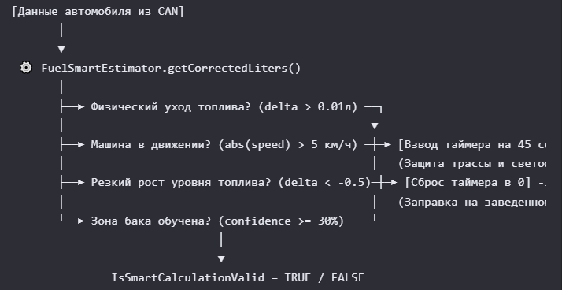

# ⛽ Модификация топливного модуля (Гибридный режим v2.2)

Настоящий документ описывает логику интеграции и настройки интеллектуального селектора среднего расхода топлива (**Штатное ГУ автомобиля** vs **Наш калиброванный алгоритм**) для работы в реальной Android-среде с данными из CAN-шины / OBD2 через объектную модель `FuelEntry`.

---

## 🔑 Новые и измененные компоненты модуля

| Класс                        | Переменная / Метод          | Тип                 | Назначение и физика работы (v2.2)                                                                                                                              |
|:-----------------------------|:----------------------------|:--------------------|:---------------------------------------------------------------------------------------------------------------------------------------------------------------|
| **EstimationResult**         | `isSmartCalculationValid`   | `Boolean`           | **Главный UI-флаг.** Разрешает вывод нашего расхода на экран ГУ. Активируется только в движении при достаточной зрелости зоны бака.                            |
| **FuelSmartEstimator**       | `lastDrivingLevel`          | `Double`            | **Память уровня.** Хранит предыдущее стабильное значение датчика для вычисления дельты физического ухода топлива.                                              |
| **FuelSmartEstimator**       | `smartCalculationHoldTimer` | `Int`               | **Гистерезис движения.** Буфер на 45 сек. Защищает от светофоров. Мгновенно сбрасывается в `0` при резком росте уровня (заправка на ходу).                     |
| **FuelSmartEstimator**       | `getCorrectedLiters(...)`   | `Method`            | **Ядро триггеров.** Принимает единый объект `FuelEntry`. Скорость внутри автоматически оборачивается в `abs()`, корректно обрабатывая задний ход при парковке. |
| **FuelEfficiencyCalculator** | `getHybridConsumption(...)` | `Method`            | **Селектор индикации.** Выбирает источник расхода. На входе использует путевые счетчики, вовремя очищенные триггером АЗС (>20% бака).                          |

--- 

## 🧠 Логика работы триггеров переключения

[Телематический снимок CAN-данных автомобиля]
            │
            ▼
data class FuelEntry
            │
                ▼
⚙️ FuelSmartEstimator.getCorrectedLiters()
                    │
├──► Физический уход топлива? (delta > 0.01л) ──┐
│                                               ▼
├──► Машина в движении? (abs(speed) > 5 км/ч)   ┼───► [Взвод таймера на 45 сек]
│                                               │      (Защита трассы и светофоров)
├──► Резкий рост уровня топлива? (delta < -0.5) ┼───► [Сброс таймера в 0] -> Форс на ГУ
│                                               │      (Заправка на заведенном моторе)
└──► Зона бака обучена? (confidence >= 30%)  ───┘
                    │
                    ▼
IsSmartCalculationValid = TRUE / FALSE

# 🛠 Модификация топливного модуля (Гибридный режим v2.2)

Настоящий документ описывает логику интеграции и настройки интеллектуального селектора среднего 
расхода топлива (**Штатное ГУ автомобиля** vs **Наш калиброванный алгоритм**) для работы в реальной Android-среде с данными из CAN-шины / OBD2.

---

### 🔑 Важные переменные для UI и Бизнес-логики
При интеграции модуля в архитектуру приложения (ViewModel / Service) необходимо оперировать следующими ключевыми полями:

# 1. EstimationResult.isSmartCalculationValid (Boolean)
   Назначение: Главный флаг-разрешение. Сигнализирует слою UI, можно ли отображать наш расход.
   Поведение: Выставляется в true только в движении при условии, что текущая зона бака достаточно обучена.
# 2. FuelSmartEstimator.smartCalculationHoldTimer (Int)
   Назначение: Гистерезис движения (буферный таймер).
   Поведение: Шаг дискретизации — 1 секунда (или 1 цикл обновления данных). Удерживает наш алгоритм активным в течение 45 секунд после остановки на светофоре или при плескании топлива.
# 3. minConfidenceThreshold (Double, по умолчанию 0.3)
   Назначение: Порог зрелости калибровки зоны (30%).
   Критерий подстройки:
   0.2: Если водитель заправляется на одних и тех же АЗС (для более быстрого включения).
   0.4: Если нужна эталонная точность (консервативный режим).

### 🏎 Физика триггеров и защита от системных ошибок
   Алгоритм версии v2.2 полностью инкапсулирует входящие параметры внутри объекта FuelEntry и защищен от следующих краевых кейсов ("edge cases"):

# 1. Защита от «моргания» экрана на кочках (Дребезг поплавка)
   Проблема: В движении топливо плещется, датчик ловит ложные колебания вверх/вниз. Без защиты экран расхода может переключаться каждую секунду между "Нашим" и "Штатным".
   Решение: Внедрен таймер удержания (Hold Timer) на 45 секунд. При любом прыжке датчика вверх в движении система бесшовно продолжает отображать наш расход, игнорируя микро-шумы.
# 2. Защита от «засыпания» на трассе (Круиз-контроль)
   Проблема: На ровной трассе расход топлива минимален. Физическое падение уровня (delta > 0.01л) может происходить раз в 40–50 секунд. Старый таймер успевал обнулиться и переключал систему на штатное ГУ прямо во время поездки.
   Решение: Введен жесткий триггер движения через обращение к объекту:
   Kotlin

val isMoving = kotlin.math.abs(entry.currentSpeedKmH) > 5.0
Пока автомобиль движется по трассе с заведенным мотором, таймер принудительно "подпитывается" и не дает системе уйти в спящий режим.
# 3. Учет маневрирования (Задний ход)
   Проблема: При парковке задним ходом скорость из CAN-шины может приходить со знаком минус (например, -7 км/ч), что ломало линейное условие speed > 5.0. Система думала, что машина стоит.
   Решение: Все проверки скорости внутри эстиматора обернуты в модуль числа:
   Kotlin

kotlin.math.abs(entry.currentSpeedKmH)
Задний ход теперь учитывается как полноценное движение, сохраняя валидность нашего алгоритма.
# 4. Заправка на ходу / С заведенным мотором
   Проблема: Если водитель заправляет автомобиль, не глуша двигатель, уровень топлива резко идет вверх. Это может ложно взвести триггер движения.
   Решение: Добавлен детектор резкого роста уровня:
   Kotlin

// Если за секунду дельта lastDrivingLevel - entry.sensorBefore падает ниже -0.5 литров
if ((lastDrivingLevel - entry.sensorBefore) < -0.5) {
smartCalculationHoldTimer = 0 // Сброс
}
Таймер принудительно сбрасывается в 0. Это мгновенно переключает экран на OEM-расход ГУ до полной стабилизации поплавка, исключая математические аномалии.

### ⛽️ Архитектурные правила обработки АЗС (Важно!)Для исключения ловушки «Зависания расхода» 
# (когда путевой расход считает среднее значение с учетом предыдущих баков и пройденных тысяч километров), 
# необходимо строго разделять полноценную заправку и микро-доливку топлива:kotlin// Логика, которую необходимо внедрить в фоновый сервис обработки заправок:
# val isRefueled = entry.sensorAfter > entry.sensorBefore + 2.0 // Залили более 2 литров

if (isRefueled) {
val refillPercent = entry.litersByCheck / estimator.tankCapacity
    if (refillPercent > 0.20) { 
        // Кейс А: Залили более 20% от объема бака (от 10 литров для бака 50л).
        // Это полноценный старт нового цикла.
        totalLiters = 0.0
        totalDistance = 0.0
        totalHours = 0.0
        efficiencyCalculator.resetTripStats() // Очищаем "хвост" старой статистики пробега
        println("Новый цикл расчета: существенная заправка (>20%), статистика сброшена.")
    } else {
        // Кейс Б: Микро-доливка (долили 3-5 литров "до ровного счета").
        // Статистика накопления расхода продолжается без сброса, чтобы не ломать математику.
        println("Зафиксирована микро-доливка топлива. Статистика путевого расхода продолжается.")
    }
}

### 💻 Рекомендация по интеграции в Android (Data Flow)Для бесшовного обновления интерфейса рекомендуется обернуть 
# результат вычислений в StateFlow внутри вашего репозитория или ViewModel. Теперь на вход метода подается исключительно 
# сформированный объект FuelEntry:kotlin// Внутри репозитория CAN-данных
private val _fuelEstimation = MutableStateFlow<EstimationResult?>(null)
val fuelEstimation = _fuelEstimation.asStateFlow()

fun onCanBusFrameProcessed(canEntry: FuelEntry) {
// Чистый вызов без разрозненных параметров. Порог 0.3 подставится автоматически.
val result = estimator.getCorrectedLiters(canEntry)
_fuelEstimation.value = result
}

### В UI-слое (Compose или XML) достаточно подписаться на поток:Если isSmartCalculationValid == true — отрисовываем на приборной 
# панели значение из efficiencyCalculator.getHybridConsumption(...) и подсвечиваем иконку ⚡ [Калиброванный расчет].
# Если isSmartCalculationValid == false — плавно выводим сырое значение расхода, пришедшее из штатного CAN-пакета приборной панели автомобиля (🚗 [ШТАТНОЕ ГУ]).