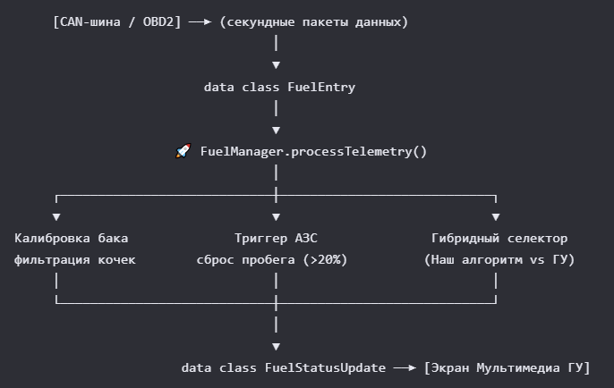

### 🏗 Архитектурная концепция «Всё в одном».
Вместо раздельного вызова эстиматоров и калькуляторов, 
слой бизнес-логики Android (Service или ViewModel) взаимодействует только с одним классом — FuelManager.
# Разработчику достаточно просто отправлять в менеджер секундные телематические снимки FuelEntry. 
# Класс самостоятельно:
1. Вычисляет путевые дельты времени, пробега и сожженных литров.
2. Прогоняет уровень бака через калибровочную температурную модель.
3. Отслеживает триггеры АЗС и автоматически сбрасывает счетчики при существенной заправке (>20% бака).
4. Возвращает готовый структурированный отчет FuelStatusUpdate для мгновенного вывода на экран ГУ.

        [CAN-шина / OBD2] ──► (секундные пакеты данных)
                             │
                             ▼
                    data class FuelEntry
                             │
                             ▼
            🚀 FuelManager.processTelemetry()
                             │
┌────────────────────────────┼────────────────────────────┐
▼                            ▼                            ▼
Калибровка бака              Триггер АЗС               Гибридный селектор
фильтрация кочек        сброс пробега (>20%)          (Наш алгоритм vs ГУ)
│                            │                            │
└────────────────────────────┼────────────────────────────┘
                             │
                             ▼
data class FuelStatusUpdate ──► [Экран Мультимедиа ГУ]

### 📦 Спецификация моделей данных (v3.0)
# 1. Что подается на вход: FuelEntry (Data Class)
# Единый снимок состояния автомобиля из CAN-шины для конкретного цикла:
data class FuelEntry(
val odometerKm: Double,             // Текущий пробег автомобиля по одометру (км)
val engineHours: Double,            // Наработка двигателя в моточасах (ч)
val sensorBefore: Double,           // Показания датчика уровня топлива ДО заправки (л)
val sensorAfter: Double,            // Показания датчика уровня топлива ПОСЛЕ заправки (л)
val litersByCheck: Double,          // Реально заправленные литры по чеку с АЗС (л)
val ambientTemp: Double = 15.0,     // Температура за бортом (°C)
val isEngineRunning: Boolean = true,// Заведен ли двигатель автомобиля в данный момент
val currentSpeedKmH: Double = 60.0, // Текущая скорость автомобиля (км/ч)
val dashboardAvgConsumption: Double? = null // Расход со штатного бортового компьютера (л/100км)
)

# 2. Что отдается на UI-слой: FuelStatusUpdate (Data Class)
# Готовый пакет данных, полностью закрывающий потребности интерфейса ГУ:
data class FuelStatusUpdate(
val finalConsumption: Double,      // СРЕДНИЙ РАСХОД: для вывода текстом в л/100км (например, 8.5)
val fuelConsumedSinceLast: Double, // СОЖЖЕНО С ПРОШЛОГО РАЗА: сколько литров сгорело за тик (л)
val totalLitersThisTrip: Double,   // ВСЕГО СОЖЖЕНО: литры за всю текущую поездку/цикл бака (л)
val isSmartActive: Boolean,        // ИСТОЧНИК: наш алгоритм (true) или штатное ГУ (false)
val remainingLiters: Double,       // ОСТАТОК В ЛИТРАХ: на экран текстом (например, 45.2 л)
val remainingPercent: Int          // ОСТАТОК В ПРОЦЕНТАХ: для прогресс-бара/шкалы (число от 0 до 100)
)

###  🛠 Пошаговый гайд по интеграции в Android
# Шаг 1. Инициализация при старте (в Android Service или Repository)
Создайте экземпляр менеджера один раз, передав в него зависимости:
val fuelManager = FuelManager(fuelSmartEstimator, fuelEfficiencyCalculator)

### Шаг 2. Вызов в одну строчку в обработчике CAN-шины
При приходе каждого нового пакета данных из автомобиля просто передайте его в менеджер:

// Внутри слушателя OBD2 / CAN-адаптера:
fun onNewCanFrameReceived(rawFrame: FuelEntry) {
    // ОТПРАВЛЯЕМ ДАННЫЕ В МЕНЕДЖЕР — вся математика и накопители крутятся внутри
    val update: FuelStatusUpdate = fuelManager.processTelemetry(rawFrame)
    // ОБНОВЛЯЕМ ЭКРАН ГУ ГОТОВЫМИ ДАННЫМИ:
    binding.textAverageConsumption.text = "${"%.1f".format(update.finalConsumption)} л/100км"
    binding.textRemainingLiters.text = "${"%.1f".format(update.remainingLiters)} л"
    binding.textFuelPercent.text = "${update.remainingPercent}%"
    // Закрашиваем графический прогресс-бар шкалы бака
    binding.fuelProgressBar.progress = update.remainingPercent
    // Подсвечиваем иконку источника расхода
    if (update.isSmartActive) {
        binding.iconSource.setImageResource(R.drawable.ic_smart_calculation) // Наш калиброванный расчет
    } else {
        binding.iconSource.setImageResource(R.drawable.ic_oem_dashboard)      // Штатное ГУ машины
    }
}

### 🧠 Ключевые физические алгоритмы под капотом FuelManager

1. Защита от «Зависания» расхода (Фильтрация АЗС):
При фиксации роста уровня entry.sensorAfter > entry.sensorBefore + 2.0 менеджер вычисляет refillPercent. 
Если заправка составила более 20% от емкости бака, класс автоматически сбрасывает все путевые накопители 
километров, литров и моточасов в ноль, принудительно запуская расчет среднего расхода с чистого листа для 
нового бака. Микро-доливки до 20% игнорируются для сохранения непрерывности путевой статистики.

2. Защита от прыжков температуры на 100% баке:
При полной заправке, когда поплавок доходит до верхней зоны (stdVolume >= sensorMax - 1.5), 
менеджер выводит ровные паспортные параметры бака (например, 57.0 л и 100%), аппаратно блокируя 
влияние минутного нагрева датчиков на жаре (+35°C). Как только бак пустеет, включается ювелирный 
температурный учет физического объема бензина.

3. Защита от ползущих пробок и светофоров:
Hold-таймер удержания (45 секунд) подпитывается не только от скорости движения abs(currentSpeedKmH) > 5.0 (включая задний ход), 
но и от триггера падения поплавка isFuelDroppingNow. Если машина ползет в глухом заторе со скоростью 2 км/ч, 
но реальный расход топлива идет, таймер удерживает ⚡ [НАШ АЛГОРИТМ] активным, предотвращая хаотичные перескоки экрана на штатный бортовик.